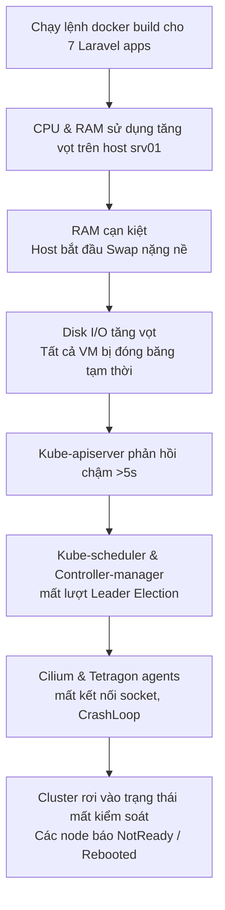

# Báo cáo chẩn đoán sự cố sập hệ thống khi Rebuild Laravel

## 1. Hiện trạng hệ thống (Hiện tại)
- **Elasticsearch (es-0)**: Đang chạy ổn định (**1/1 Running**) với cấu hình Persistent Volume (PVC) gốc. Dung lượng đĩa trên node `srv03` hiện còn trống **9.4GB (46% used)** (rất an toàn sau khi chạy dọn dẹp log cũ).
- **Các Laravel Microservices**: Đang chạy ổn định (**4/4 containers**) ở namespace `job7189-apps`.
- **Uptime của hệ thống**: Các node (`srv01`, `srv02`, `srv03`, `srv05`) đều đang ở trạng thái `Ready`. Uptime của host `srv01` là 13 ngày, tuy nhiên kubelet và containerd trên tất cả các node đều ghi nhận sự kiện khởi động lại (restart/reboot) cách đây khoảng 11-12 tiếng (tức là khoảng 10 giờ sáng hôm nay, ngay sau khi bạn cố gắng deploy/build lại).

---

## 2. Nguyên nhân gốc gây sập toàn bộ hệ thống (OOM & Control Plane Starvation)

Khi bạn chạy quy trình rebuild Laravel (`03-deploy-microservices.sh` -> gọi `04-build-and-push-images.sh`), một chuỗi sự kiện sụt giảm tài nguyên nghiêm trọng đã xảy ra trên máy chủ:



### Chi tiết kỹ thuật:

1. **Tranh chấp tài nguyên do overcommit**:
   - Cluster chạy rất nhiều thành phần bảo mật của ZTA (Cilium, Tetragon, Spire Server/Agent, Gatekeeper, OPA, PDP controller). Các thành phần này cài dưới dạng DaemonSet (chạy trên tất cả các node) và tiêu tốn một lượng RAM nền rất lớn.
   - Khi chạy build ảnh Docker cho 7 Laravel microservices (sử dụng PHP-FPM, composer install, v.v.), tiến trình `docker build` ngốn tài nguyên CPU và RAM cực kỳ lớn. Do RAM vật lý của host bị giới hạn (~12GB cho các VM), hệ thống bị ép phải sử dụng **Swap**.

2. **Control Plane bị bỏ đói (Starvation)**:
   - Khi bắt đầu swap, tốc độ xử lý của CPU giảm mạnh và I/O của đĩa bị nghẽn.
   - Các tiến trình Kubernetes quan trọng hoạt động dựa trên cơ chế cập nhật trạng thái định kỳ (Lease / Heartbeat). Do hệ thống bị nghẽn, `kube-apiserver` không thể xử lý kịp các yêu cầu này trong vòng 5 giây.
   - **Kube-scheduler** và **kube-controller-manager** tin rằng đối thủ của chúng đã chết nên bắt đầu tranh giành quyền điều phối (leader election lost/timeout), dẫn đến CrashLoop liên tục.
   - **Cilium CNI** bị mất kết nối tới agent socket, khiến toàn bộ luồng mạng nội bộ giữa các pod (kể cả DNS) bị đứt gãy. Từ đó, pod `zta-pdp` và các pod khác báo lỗi `unable to connect to Cilium agent: no such file or directory`.

3. **Cơ chế tự bảo vệ của Kubelet**:
   - Khi đĩa hoặc RAM vượt ngưỡng cực hạn, Kubelet sẽ tự động evict các pod không thiết yếu hoặc kích hoạt khởi động lại dịch vụ containerd/kubelet trên node để giải phóng tài nguyên. Trong log hệ thống ghi nhận các node bị chuyển sang trạng thái `NotReady` và sau đó tự khởi động lại.

---

## 3. Lý do Laravel báo lỗi SQLSTATE [1045] Access Denied (MySQL)

Trong nhật ký log của `identity-service`, chúng ta thấy lỗi lặp đi lặp lại:
```
production.ERROR: Identity Auth Failed: SQLSTATE[HY000] [1045] Access denied for user 'v-kubernetes-identity-s-cLUdO55u'@'10.244.2.203'
```

### Nguyên nhân:
1. **Lệch pha Lease của Vault và cache của Laravel**:
   - Hệ thống ZTA của bạn sử dụng **Vault Dynamic DB Credentials**. Mỗi khi Laravel pod khởi động, `vault-agent` sidecar sẽ yêu cầu một tài khoản MySQL tạm thời từ Vault (ví dụ: `v-kubernetes-identity-s-xxxxx`), ghi vào `/vault/secrets/.env.db` và Laravel sẽ đọc file này để kết nối tới database.
   - Các tài khoản MySQL động này có thời gian sống (TTL/Lease) giới hạn (ví dụ: 1 giờ).
   - Khi hệ thống bị treo hoặc restart nửa chừng do cạn kiệt tài nguyên (OOM), Vault Server và MySQL đã thu hồi (revoke/delete) các user này trong cơ sở dữ liệu.
   - Tuy nhiên, Pod Laravel do bị treo hoặc cache cấu hình (`php artisan config:cache` ghi đè cấu hình cũ) vẫn giữ thông tin đăng nhập cũ (`v-kubernetes-identity-s-cLUdO55u`) đã hết hạn để kết nối, dẫn đến lỗi **Access Denied 1045** liên tục cho đến khi container Laravel được reload/restart sạch sẽ.

---

## 4. Khuyến nghị giải pháp để không làm sập hệ thống khi Rebuild

> [!WARNING]
> Tuyệt đối không nên build trực tiếp các ảnh Docker lớn (7 microservices cùng lúc) trên môi trường cluster ảo hóa thiếu RAM, vì nó chắc chắn sẽ kích hoạt OOM và làm sập Control Plane của Kubernetes.

### Giải pháp A: Build ảnh Docker từ máy ngoài (Khuyên dùng)
- Thực hiện build các ảnh Laravel Docker trên máy local của bạn (hoặc máy CI/CD có cấu hình mạnh độc lập).
- Push các ảnh đó lên một Docker Registry ngoài (Docker Hub, GHCR, hoặc Registry riêng).
- Trên cluster Kubernetes, chỉ cần cập nhật tag image trong file values và chạy `helmfile apply`. Việc này chỉ tốn vài giây và Kubernetes chỉ cần pull ảnh về chạy, không tốn CPU/RAM để compile hay build.

### Giải pháp B: Bật tính năng Force Rebuild có chọn lọc
Trong script `03-deploy-microservices.sh`, bạn có dòng:
```bash
export FORCE_REBUILD_IMAGES=${FORCE_REBUILD_IMAGES:-0}
```
- Đảm bảo tham số này luôn bằng `0` nếu không có thay đổi về code Laravel. Điều này giúp bỏ qua bước build ảnh Docker và sử dụng lại ảnh cũ có sẵn trong registry cục bộ, tránh vắt kiệt RAM của host.
- Nếu bắt buộc phải build lại, hãy build **từng service một** thay vì chạy build hàng loạt 7 services cùng lúc bằng cách sửa tạm thời danh sách build trong script.

### Giải pháp C: Tắt tạm thời các dịch vụ không thiết yếu trước khi build
Nếu bắt buộc phải build trên host:
1. Tắt tạm thời Kibana, Grafana, phpMyAdmin để giải phóng khoảng ~1.2GB RAM (sử dụng script `scripts/toggle-internal-ui.sh`).
2. Chạy dọn dẹp các container và image rác trước khi build để tránh DiskPressure:
   ```bash
   docker image prune -af
   ```
3. Sau khi build và deploy xong, bật lại các giao diện quản lý.
