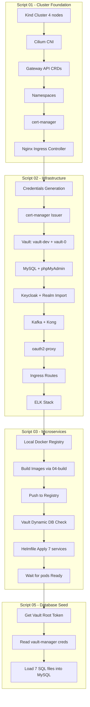
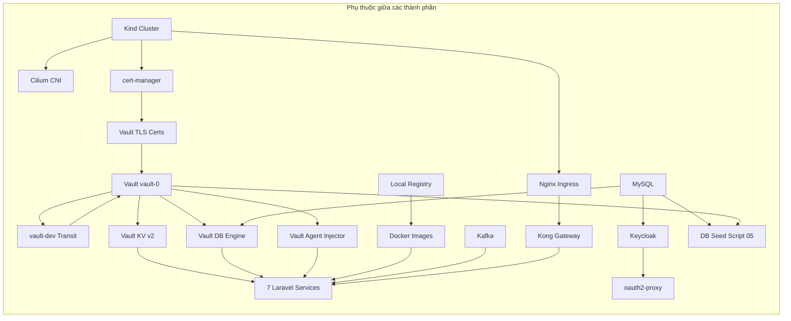

# 🚀 JOB7189 System Startup Flow Analysis

> **Hệ thống**: JOB7189 Zero Trust Architecture  
> **Thứ tự chạy**: `01-setup-cluster.sh` → `02-deploy-infrastructure.sh` → `03-deploy-microservices.sh` → `05-seed-databases.sh`  
> **Ngày phân tích**: 2026-04-19

---

## Mục lục

1. [Tổng quan kiến trúc](#1-tổng-quan-kiến-trúc)
2. [Script 01: Setup Cluster](#2-script-01-setup-cluster)
3. [Script 02: Deploy Infrastructure](#3-script-02-deploy-infrastructure)
4. [Script 03: Deploy Microservices](#4-script-03-deploy-microservices)
5. [Script 05: Seed Databases](#5-script-05-seed-databases)
6. [Bản đồ file tham chiếu](#6-bản-đồ-file-tham-chiếu)
7. [Dependency Graph](#7-dependency-graph)
8. [Danh sách Namespace → Pods](#8-danh-sách-namespace--pods)

---

## 1. Tổng quan kiến trúc



---

## 2. Script 01: Setup Cluster

**File**: [01-setup-cluster.sh](file:///home/ptb/project/DATN/01-setup-cluster.sh)

### Luồng thực thi (8 bước)

| Bước | Mô tả | File tham chiếu |
|------|--------|-----------------|
| 1/8 | Xoá cluster cũ | `kind delete cluster --name job7189` |
| 2/8 | Tạo Kind cluster (4 nodes) | [infras/kind/kind-config.yaml](file:///home/ptb/project/DATN/infras/kind/kind-config.yaml) |
| 3/8 | Thêm Helm repos | cilium, hashicorp, ingress-nginx |
| Pre-4 | Chờ K8s API Server sẵn sàng | kubectl cluster-info (max 120s) |
| 4/8 | Cài Gateway API CRDs v1.1.0 | Remote: `github.com/kubernetes-sigs/gateway-api` |
| 5/8 | Cài Cilium CNI v1.19.1 | [k8s-management/cilium/cilium-values.yaml](file:///home/ptb/project/DATN/k8s-management/cilium/cilium-values.yaml) |
| 5c | Stability-first policy | patch cilium-config ConfigMap |
| 6/8 | Tạo Namespaces | `gateway, security, management, data, job7189-apps, monitoring, vault` |
| 7/8 | Cài cert-manager v1.14.7 | Remote: `github.com/cert-manager/cert-manager` |
| 8/8 | Cài Nginx Ingress Controller | Remote: `kubernetes/ingress-nginx controller-v1.15.0` |

### Kind Cluster Config

```yaml
# infras/kind/kind-config.yaml
# 1 control-plane + 3 workers
# Port mappings trên worker thứ 3:
#   80   → 30000 (HTTP)
#   443  → 30001 (HTTPS)
#   8200 → 30002 (Vault)
#   8080 → 30003
#   31000→ 30004
```

### Cilium Config Highlights

```yaml
# k8s-management/cilium/cilium-values.yaml
ipam.mode: kubernetes
routingMode: tunnel (VXLAN)
kubeProxyReplacement: true
hubble: enabled (relay + ui)
gatewayAPI: enabled
# Script 01 overrides: encryption=false, authentication=false (stability-first)
```

### Files trực tiếp liên kết từ Script 01

| File | Đường dẫn tuyệt đối |
|------|---------------------|
| Kind config | [infras/kind/kind-config.yaml](file:///home/ptb/project/DATN/infras/kind/kind-config.yaml) |
| Cilium values | [k8s-management/cilium/cilium-values.yaml](file:///home/ptb/project/DATN/k8s-management/cilium/cilium-values.yaml) |

---

## 3. Script 02: Deploy Infrastructure

**File**: [02-deploy-infrastructure.sh](file:///home/ptb/project/DATN/02-deploy-infrastructure.sh)

### Cấu hình quan trọng

```bash
CLUSTER_NAME="job7189"
REGISTRY_HOST="localhost:5000"
NODE_REGISTRY_ENDPOINT="172.17.0.1:5000"
KEYCLOAK_IMAGE_REPO="job7189/keycloak-custom"
KEYCLOAK_IMAGE_TAG="v1.0"
```

### Luồng thực thi (10 bước)

| Bước | Mô tả | Files tham chiếu | Namespace |
|------|--------|-------------------|-----------|
| 0 | Pre-flight + tạo namespaces | - | vault, data, management, job7189-apps, security, gateway, monitoring, ingress-nginx, cert-manager |
| **1** | **Generate Credentials** | Tạo K8s Secret `app-secrets` ở namespace `data` và `security` | data, security |
| **2** | **cert-manager Issuer** | [infras/k8s-yaml/10-cert-manager-issuer.yaml](file:///home/ptb/project/DATN/infras/k8s-yaml/10-cert-manager-issuer.yaml) | cert-manager |
| **3** | **Vault Deployment** | [infras/k8s-yaml/11-vault.yaml](file:///home/ptb/project/DATN/infras/k8s-yaml/11-vault.yaml) → gọi [99-fast-rebuild-vault.sh](file:///home/ptb/project/DATN/infras/k8s-yaml/vault-scripts/99-fast-rebuild-vault.sh) | vault |
| **4** | **MySQL + phpMyAdmin** | [infras/k8s-yaml/mysql-init-configmap.yaml](file:///home/ptb/project/DATN/infras/k8s-yaml/mysql-init-configmap.yaml) + [infras/k8s-yaml/01-mysql-phpmyadmin.yaml](file:///home/ptb/project/DATN/infras/k8s-yaml/01-mysql-phpmyadmin.yaml) | data |
| **5** | **Keycloak** | Build image từ [infras/keycloak/Dockerfile](file:///home/ptb/project/DATN/infras/keycloak/Dockerfile), deploy [infras/k8s-yaml/02-keycloak.yaml](file:///home/ptb/project/DATN/infras/k8s-yaml/02-keycloak.yaml), import realm [infras/keycloak/realms/realm-job7189.json](file:///home/ptb/project/DATN/infras/keycloak/realms/realm-job7189.json) | security |
| **6** | **Kafka + Kong** | [infras/k8s-yaml/03-kafka.yaml](file:///home/ptb/project/DATN/infras/k8s-yaml/03-kafka.yaml) + [infras/kong/01_setup_kong_config.sh](file:///home/ptb/project/DATN/infras/kong/01_setup_kong_config.sh) → [infras/kong/kong.yml](file:///home/ptb/project/DATN/infras/kong/kong.yml) + [infras/k8s-yaml/04-kong-dbless.yaml](file:///home/ptb/project/DATN/infras/k8s-yaml/04-kong-dbless.yaml) | data (Kafka), gateway (Kong) |
| **7** | **oauth2-proxy** | [infras/k8s-yaml/ingress/00_setup_oauth2_proxy.sh](file:///home/ptb/project/DATN/infras/k8s-yaml/ingress/00_setup_oauth2_proxy.sh) → [infras/k8s-yaml/ingress/04_oauth2_proxy.yaml](file:///home/ptb/project/DATN/infras/k8s-yaml/ingress/04_oauth2_proxy.yaml) | security |
| **8** | **Ingress Routes** | [01_ingress_public.yaml](file:///home/ptb/project/DATN/infras/k8s-yaml/ingress/01_ingress_public.yaml), [02_ingress_oauth2_callback.yaml](file:///home/ptb/project/DATN/infras/k8s-yaml/ingress/02_ingress_oauth2_callback.yaml), [03_ingress_internal.yaml](file:///home/ptb/project/DATN/infras/k8s-yaml/ingress/03_ingress_internal.yaml), [05_nginx_ingress_service.yaml](file:///home/ptb/project/DATN/infras/k8s-yaml/ingress/05_nginx_ingress_service.yaml), [07_oauth2_proxy_alias.yaml](file:///home/ptb/project/DATN/infras/k8s-yaml/ingress/07_oauth2_proxy_alias.yaml) | ingress-nginx |
| **9** | **ELK Stack** | [infras/k8s-yaml/05-elasticsearch.yaml](file:///home/ptb/project/DATN/infras/k8s-yaml/05-elasticsearch.yaml) + [infras/k8s-yaml/06-filebeat.yaml](file:///home/ptb/project/DATN/infras/k8s-yaml/06-filebeat.yaml) | monitoring |
| **10** | **Validation** | kubectl get pod -A, kiểm tra tất cả Running + Ready | - |

### Vault Fast Rebuild Pipeline (chi tiết)

Script [99-fast-rebuild-vault.sh](file:///home/ptb/project/DATN/infras/k8s-yaml/vault-scripts/99-fast-rebuild-vault.sh) thực hiện:

| Sub-step | Mô tả | Files con |
|----------|--------|-----------|
| 1/6 | Cleanup Vault cũ (parallel delete) | - |
| 2/6 | Deploy K8s resources | [10-cert-manager-issuer.yaml](file:///home/ptb/project/DATN/infras/k8s-yaml/10-cert-manager-issuer.yaml) + [11-vault.yaml](file:///home/ptb/project/DATN/infras/k8s-yaml/11-vault.yaml) |
| 3/6 | Init vault-dev (Transit Unsealer) | Enable transit engine |
| 4/6 | Init vault-prod (vault-0) | Lưu kết quả → [vault-prod-init.json](file:///home/ptb/project/DATN/infras/k8s-yaml/vault-scripts/vault-prod-init.json) |
| 5/6 | Batch config: K8s auth, KV v2, Database engine | Tạo 7 DB roles, 7 K8s auth roles, KV secrets |
| 6/6 | Install Vault Injector | [07_install_injector.sh](file:///home/ptb/project/DATN/infras/k8s-yaml/vault-scripts/07_install_injector.sh) + [vault-injector-values.yaml](file:///home/ptb/project/DATN/infras/k8s-yaml/vault-scripts/vault-injector-values.yaml) |

#### Vault KV Secrets được tạo

| KV Path | Nội dung |
|---------|----------|
| `secret/keycloak` | db-password, admin-password |
| `secret/mysql` | root-password |
| `secret/vault-manager` | username, password |
| `secret/laravel-common` | app_env, app_debug, log_channel, cache_store, queue_connection |
| `secret/{service-name}` (×7) | service_name, placeholder |

#### Vault Database Roles (×7)

| Role | Database | TTL |
|------|----------|-----|
| identity-service | job7189_identity_db | 1h / 24h |
| workspace-service | job7189_workspace_db | 1h / 24h |
| job-service | job7189_job_db | 1h / 24h |
| hiring-service | job7189_hiring_db | 1h / 24h |
| candidate-service | job7189_candidate_db | 1h / 24h |
| communication-service | job7189_communication_db | 1h / 24h |
| storage-service | job7189_storage_db | 1h / 24h |

### Keycloak Build Chain

```
infras/keycloak/Dockerfile
├── Base: quay.io/keycloak/keycloak:22.0.5
├── COPY custom-job7189/ → /opt/keycloak/themes/custom-job7189
├── COPY custom-job7189a/ → /opt/keycloak/themes/custom-job7189a
├── COPY realm-infra.json → /opt/keycloak/data/import/
└── RUN kc.sh build

Sau deploy, import thêm: infras/keycloak/realms/realm-job7189.json
```

### Files trực tiếp liên kết từ Script 02

| File | Đường dẫn tuyệt đối |
|------|---------------------|
| cert-manager Issuer | [infras/k8s-yaml/10-cert-manager-issuer.yaml](file:///home/ptb/project/DATN/infras/k8s-yaml/10-cert-manager-issuer.yaml) |
| Vault deployment | [infras/k8s-yaml/11-vault.yaml](file:///home/ptb/project/DATN/infras/k8s-yaml/11-vault.yaml) |
| Vault rebuild script | [infras/k8s-yaml/vault-scripts/99-fast-rebuild-vault.sh](file:///home/ptb/project/DATN/infras/k8s-yaml/vault-scripts/99-fast-rebuild-vault.sh) |
| Vault init result | [infras/k8s-yaml/vault-scripts/vault-prod-init.json](file:///home/ptb/project/DATN/infras/k8s-yaml/vault-scripts/vault-prod-init.json) |
| Vault injector install | [infras/k8s-yaml/vault-scripts/07_install_injector.sh](file:///home/ptb/project/DATN/infras/k8s-yaml/vault-scripts/07_install_injector.sh) |
| Vault injector values | [infras/k8s-yaml/vault-scripts/vault-injector-values.yaml](file:///home/ptb/project/DATN/infras/k8s-yaml/vault-scripts/vault-injector-values.yaml) |
| MySQL init ConfigMap | [infras/k8s-yaml/mysql-init-configmap.yaml](file:///home/ptb/project/DATN/infras/k8s-yaml/mysql-init-configmap.yaml) |
| MySQL deployment | [infras/k8s-yaml/01-mysql-phpmyadmin.yaml](file:///home/ptb/project/DATN/infras/k8s-yaml/01-mysql-phpmyadmin.yaml) |
| Keycloak deployment | [infras/k8s-yaml/02-keycloak.yaml](file:///home/ptb/project/DATN/infras/k8s-yaml/02-keycloak.yaml) |
| Keycloak Dockerfile | [infras/keycloak/Dockerfile](file:///home/ptb/project/DATN/infras/keycloak/Dockerfile) |
| Keycloak themes (×2) | [infras/keycloak/custom-job7189/](file:///home/ptb/project/DATN/infras/keycloak/custom-job7189), [infras/keycloak/custom-job7189a/](file:///home/ptb/project/DATN/infras/keycloak/custom-job7189a) |
| Keycloak realm (import) | [infras/keycloak/realm-infra.json](file:///home/ptb/project/DATN/infras/keycloak/realm-infra.json) |
| Keycloak realm (API import) | [infras/keycloak/realms/realm-job7189.json](file:///home/ptb/project/DATN/infras/keycloak/realms/realm-job7189.json) |
| Kafka deployment | [infras/k8s-yaml/03-kafka.yaml](file:///home/ptb/project/DATN/infras/k8s-yaml/03-kafka.yaml) |
| Kong config script | [infras/kong/01_setup_kong_config.sh](file:///home/ptb/project/DATN/infras/kong/01_setup_kong_config.sh) |
| Kong declarative config | [infras/kong/kong.yml](file:///home/ptb/project/DATN/infras/kong/kong.yml) |
| Kong deployment | [infras/k8s-yaml/04-kong-dbless.yaml](file:///home/ptb/project/DATN/infras/k8s-yaml/04-kong-dbless.yaml) |
| oauth2-proxy setup | [infras/k8s-yaml/ingress/00_setup_oauth2_proxy.sh](file:///home/ptb/project/DATN/infras/k8s-yaml/ingress/00_setup_oauth2_proxy.sh) |
| oauth2-proxy YAML | [infras/k8s-yaml/ingress/04_oauth2_proxy.yaml](file:///home/ptb/project/DATN/infras/k8s-yaml/ingress/04_oauth2_proxy.yaml) |
| Ingress public | [infras/k8s-yaml/ingress/01_ingress_public.yaml](file:///home/ptb/project/DATN/infras/k8s-yaml/ingress/01_ingress_public.yaml) |
| Ingress OAuth2 callback | [infras/k8s-yaml/ingress/02_ingress_oauth2_callback.yaml](file:///home/ptb/project/DATN/infras/k8s-yaml/ingress/02_ingress_oauth2_callback.yaml) |
| Ingress internal | [infras/k8s-yaml/ingress/03_ingress_internal.yaml](file:///home/ptb/project/DATN/infras/k8s-yaml/ingress/03_ingress_internal.yaml) |
| Nginx ingress service | [infras/k8s-yaml/ingress/05_nginx_ingress_service.yaml](file:///home/ptb/project/DATN/infras/k8s-yaml/ingress/05_nginx_ingress_service.yaml) |
| OAuth2 proxy alias | [infras/k8s-yaml/ingress/07_oauth2_proxy_alias.yaml](file:///home/ptb/project/DATN/infras/k8s-yaml/ingress/07_oauth2_proxy_alias.yaml) |
| Elasticsearch | [infras/k8s-yaml/05-elasticsearch.yaml](file:///home/ptb/project/DATN/infras/k8s-yaml/05-elasticsearch.yaml) |
| Filebeat | [infras/k8s-yaml/06-filebeat.yaml](file:///home/ptb/project/DATN/infras/k8s-yaml/06-filebeat.yaml) |
| Local registry compose | [infras/local-registry/docker-compose.yml](file:///home/ptb/project/DATN/infras/local-registry/docker-compose.yml) |

---

## 4. Script 03: Deploy Microservices

**File**: [03-deploy-microservices.sh](file:///home/ptb/project/DATN/03-deploy-microservices.sh)

### Luồng thực thi

| Bước | Mô tả | Files tham chiếu |
|------|--------|-----------------|
| Pre-flight | Check cluster, infra, namespaces, MySQL + Vault ready | - |
| **0a** | Start local Docker Registry | [infras/local-registry/docker-compose.yml](file:///home/ptb/project/DATN/infras/local-registry/docker-compose.yml) |
| **0d** | Build + push images → gọi script 04 | [04-build-and-push-images.sh](file:///home/ptb/project/DATN/04-build-and-push-images.sh) |
| 0e1 | Retag images, configure Kind registry | Chart values + Kind nodes |
| 0e2 | Push images to chart registry (172.17.0.1:5000) | - |
| 0e3 | Verify registry tags | curl registry API |
| 0f0 | Reconcile MySQL root secret → Vault | - |
| **0f** | **Vault dynamic DB readiness check** | Kiểm tra database/config/mysql, 7 roles, 7 K8s auth roles, 8 KV paths |
| **1a** | **Helmfile apply** | [k8s-management/helmfile.yaml](file:///home/ptb/project/DATN/k8s-management/helmfile.yaml) |
| 1c | Wait for 7 Laravel deployments Ready (max 900s) | - |
| 2 | Final status check | kubectl get pod -A |

### Script 04: Build & Push Images (sub-script)

**File**: [04-build-and-push-images.sh](file:///home/ptb/project/DATN/04-build-and-push-images.sh)

Builds 7 Laravel services từ source code:

| Service | Source Dir | Dockerfile |
|---------|-----------|------------|
| identity-service | [src/identity_service/laravel_back/](file:///home/ptb/project/DATN/src/identity_service/laravel_back) | [Dockerfile.production](file:///home/ptb/project/DATN/src/identity_service/laravel_back/Dockerfile.production) |
| workspace-service | [src/workspace_service/laravel_back/](file:///home/ptb/project/DATN/src/workspace_service/laravel_back) | [Dockerfile.production](file:///home/ptb/project/DATN/src/workspace_service/laravel_back/Dockerfile.production) |
| job-service | [src/job_service/laravel_back/](file:///home/ptb/project/DATN/src/job_service/laravel_back) | [Dockerfile.production](file:///home/ptb/project/DATN/src/job_service/laravel_back/Dockerfile.production) |
| hiring-service | [src/hiring_service/laravel_back/](file:///home/ptb/project/DATN/src/hiring_service/laravel_back) | [Dockerfile.production](file:///home/ptb/project/DATN/src/hiring_service/laravel_back/Dockerfile.production) |
| candidate-service | [src/candidate_service/laravel_back/](file:///home/ptb/project/DATN/src/candidate_service/laravel_back) | [Dockerfile.production](file:///home/ptb/project/DATN/src/candidate_service/laravel_back/Dockerfile.production) |
| communication-service | [src/communication_service/laravel_back/](file:///home/ptb/project/DATN/src/communication_service/laravel_back) | [Dockerfile.production](file:///home/ptb/project/DATN/src/communication_service/laravel_back/Dockerfile.production) |
| storage-service | [src/storage_service/laravel_back/](file:///home/ptb/project/DATN/src/storage_service/laravel_back) | [Dockerfile.production](file:///home/ptb/project/DATN/src/storage_service/laravel_back/Dockerfile.production) |

> **Image tag**: Lấy từ `k8s-management/values/{service}-values.yaml` (field `tag:`)

### Helmfile & Helm Chart Structure

**Helmfile**: [k8s-management/helmfile.yaml](file:///home/ptb/project/DATN/k8s-management/helmfile.yaml)

Chỉ deploy `--selector namespace=job7189-apps` (7 Laravel services, **KHÔNG** deploy frontend trong step này).

**Chart**: [k8s-management/charts/laravel-app/](file:///home/ptb/project/DATN/k8s-management/charts/laravel-app)

| File | Đường dẫn |
|------|-----------|
| Chart.yaml | [Chart.yaml](file:///home/ptb/project/DATN/k8s-management/charts/laravel-app/Chart.yaml) |
| Default values | [values.yaml](file:///home/ptb/project/DATN/k8s-management/charts/laravel-app/values.yaml) |
| Deployment template | [templates/deployment.yaml](file:///home/ptb/project/DATN/k8s-management/charts/laravel-app/templates/deployment.yaml) |
| Service template | [templates/service.yaml](file:///home/ptb/project/DATN/k8s-management/charts/laravel-app/templates/service.yaml) |
| ServiceAccount | [templates/serviceaccount.yaml](file:///home/ptb/project/DATN/k8s-management/charts/laravel-app/templates/serviceaccount.yaml) |
| Ingress | [templates/ingress.yaml](file:///home/ptb/project/DATN/k8s-management/charts/laravel-app/templates/ingress.yaml) |
| Redis sidecar | [templates/redis.yaml](file:///home/ptb/project/DATN/k8s-management/charts/laravel-app/templates/redis.yaml) |
| Migration job | [templates/migration-job.yaml](file:///home/ptb/project/DATN/k8s-management/charts/laravel-app/templates/migration-job.yaml) |
| Env watcher ConfigMap | [templates/env-watcher-configmap.yaml](file:///home/ptb/project/DATN/k8s-management/charts/laravel-app/templates/env-watcher-configmap.yaml) |
| Reload token Secret | [templates/internal-reload-token-secret.yaml](file:///home/ptb/project/DATN/k8s-management/charts/laravel-app/templates/internal-reload-token-secret.yaml) |
| Registry helper | [templates/_registry.tpl](file:///home/ptb/project/DATN/k8s-management/charts/laravel-app/templates/_registry.tpl) |
| Env watcher script | [files/env-watcher.sh](file:///home/ptb/project/DATN/k8s-management/charts/laravel-app/files/env-watcher.sh) |

### Values files (mỗi service)

| Service | Values file | Namespace |
|---------|-------------|-----------|
| Shared config | [laravel-common-values.yaml](file:///home/ptb/project/DATN/k8s-management/values/laravel-common-values.yaml) | - |
| identity-service | [identity-values.yaml](file:///home/ptb/project/DATN/k8s-management/values/identity-values.yaml) | job7189-apps |
| workspace-service | [workspace-values.yaml](file:///home/ptb/project/DATN/k8s-management/values/workspace-values.yaml) | job7189-apps |
| job-service | [job-values.yaml](file:///home/ptb/project/DATN/k8s-management/values/job-values.yaml) | job7189-apps |
| hiring-service | [hiring-values.yaml](file:///home/ptb/project/DATN/k8s-management/values/hiring-values.yaml) | job7189-apps |
| candidate-service | [candidate-values.yaml](file:///home/ptb/project/DATN/k8s-management/values/candidate-values.yaml) | job7189-apps |
| communication-service | [communication-values.yaml](file:///home/ptb/project/DATN/k8s-management/values/communication-values.yaml) | job7189-apps |
| storage-service | [storage-values.yaml](file:///home/ptb/project/DATN/k8s-management/values/storage-values.yaml) | job7189-apps |

### Pod Architecture (mỗi Laravel service)

Mỗi pod Laravel bao gồm **4 containers** + **2 init containers**, injected bởi Vault Agent:

```
Pod: {service-name}-xxxxx
├── Init Containers:
│   ├── vault-agent-init (injected by webhook)  → fetch secrets from Vault
│   ├── wait-for-vault-secrets                  → wait for /vault/secrets/.env.db
│   └── fix-perms                               → chmod app-secrets, pid dirs
├── Containers:
│   ├── vault-agent (injected by webhook)       → sidecar, renew Vault leases
│   ├── env-loader (busybox)                    → merge .env files, publish to /app-secrets
│   ├── env-watcher (alpine)                    → watch for DB rotation, call reload API
│   └── app ({service} image)                   → Laravel PHP-FPM, reads /app-secrets/.env
└── Volumes:
    ├── app-env (emptyDir, Memory)
    ├── pid (emptyDir)
    └── env-watcher-script (ConfigMap)
```

### Vault Annotations trên Deployment

```yaml
vault.hashicorp.com/agent-inject: "true"
vault.hashicorp.com/agent-init-first: "true"
vault.hashicorp.com/role: "{service-name}"
vault.hashicorp.com/tls-skip-verify: "true"

# 3 secret paths per service:
# 1. secret/data/laravel-common → .env.common (APP_KEY)
# 2. database/creds/{service}   → .env.db     (DB_USERNAME, DB_PASSWORD)
# 3. secret/data/{service}     → .env.extra  (service-specific secrets) [optional]
```

---

## 5. Script 05: Seed Databases

**File**: [05-seed-databases.sh](file:///home/ptb/project/DATN/05-seed-databases.sh)

### Luồng thực thi

| Bước | Mô tả |
|------|--------|
| 1 | Check namespace `data` + MySQL pod Ready |
| 2 | Đọc Vault root token từ [vault-prod-init.json](file:///home/ptb/project/DATN/infras/k8s-yaml/vault-scripts/vault-prod-init.json) |
| 3 | Đọc vault-manager credentials từ Vault KV (`secret/vault-manager`) |
| 4 | Validate 7 SQL files tồn tại |
| 5 | Seed mỗi DB: DROP tables → re-CREATE → INSERT IGNORE |

### SQL Files → Database Mapping

| SQL File | Database | Đường dẫn |
|----------|----------|-----------|
| job7189_identity_db.sql | job7189_identity_db | [DB/job7189_identity_db.sql](file:///home/ptb/project/DATN/DB/job7189_identity_db.sql) |
| job7189_workspace_db.sql | job7189_workspace_db | [DB/job7189_workspace_db.sql](file:///home/ptb/project/DATN/DB/job7189_workspace_db.sql) |
| job7189_job_db.sql | job7189_job_db | [DB/job7189_job_db.sql](file:///home/ptb/project/DATN/DB/job7189_job_db.sql) |
| job7189_hiring_db.sql | job7189_hiring_db | [DB/job7189_hiring_db.sql](file:///home/ptb/project/DATN/DB/job7189_hiring_db.sql) |
| job7189_candidate_db.sql | job7189_candidate_db | [DB/job7189_candidate_db.sql](file:///home/ptb/project/DATN/DB/job7189_candidate_db.sql) |
| job7189_communication_db.sql | job7189_communication_db | [DB/job7189_communication_db.sql](file:///home/ptb/project/DATN/DB/job7189_communication_db.sql) |
| job7189_storage_db.sql | job7189_storage_db | [DB/job7189_storage_db.sql](file:///home/ptb/project/DATN/DB/job7189_storage_db.sql) |

### ZTA Security Model cho DB Seed

- **KHÔNG** dùng MySQL root password trực tiếp
- Đọc `vault_manager` credentials từ Vault (`secret/vault-manager`)
- `vault_manager` user được Vault tạo trong `database/config/mysql` với quyền quản lý

---

## 6. Bản đồ file tham chiếu

### Cây thư mục tham chiếu hoàn chỉnh

```
DATN/
├── 01-setup-cluster.sh                          ← Script 01
├── 02-deploy-infrastructure.sh                  ← Script 02
├── 03-deploy-microservices.sh                   ← Script 03
├── 04-build-and-push-images.sh                  ← Sub-script (gọi từ 03)
├── 05-seed-databases.sh                         ← Script 05
│
├── DB/                                          ← SQL dump files (Script 05)
│   ├── job7189_identity_db.sql
│   ├── job7189_workspace_db.sql
│   ├── job7189_job_db.sql
│   ├── job7189_hiring_db.sql
│   ├── job7189_candidate_db.sql
│   ├── job7189_communication_db.sql
│   └── job7189_storage_db.sql
│
├── infras/
│   ├── kind/
│   │   └── kind-config.yaml                     ← Script 01 Step 2
│   │
│   ├── k8s-yaml/
│   │   ├── 01-mysql-phpmyadmin.yaml             ← Script 02 Step 4
│   │   ├── 02-keycloak.yaml                     ← Script 02 Step 5
│   │   ├── 03-kafka.yaml                        ← Script 02 Step 6
│   │   ├── 04-kong-dbless.yaml                  ← Script 02 Step 6
│   │   ├── 05-elasticsearch.yaml                ← Script 02 Step 9
│   │   ├── 06-filebeat.yaml                     ← Script 02 Step 9
│   │   ├── 10-cert-manager-issuer.yaml          ← Script 02 Step 2
│   │   ├── 11-vault.yaml                        ← Script 02 Step 3
│   │   ├── mysql-init-configmap.yaml            ← Script 02 Step 4
│   │   │
│   │   ├── vault-scripts/
│   │   │   ├── 99-fast-rebuild-vault.sh         ← Script 02 Step 3 (sub)
│   │   │   ├── 07_install_injector.sh           ← Vault rebuild Step 6/6
│   │   │   ├── vault-injector-values.yaml       ← Vault Injector Helm values
│   │   │   ├── vault-prod-init.json             ← Output: Vault init keys (Script 05 reads)
│   │   │   ├── restart_unseal.sh                ← Utility (manual)
│   │   │   ├── run-vault-rotation-job.sh        ← Utility (manual)
│   │   │   ├── vault-rotation-job.yaml          ← Rotation job template
│   │   │   └── 08_check_backend_env_injection.sh← Debug utility
│   │   │
│   │   └── ingress/
│   │       ├── 00_setup_oauth2_proxy.sh         ← Script 02 Step 7
│   │       ├── 01_ingress_public.yaml           ← Script 02 Step 8
│   │       ├── 02_ingress_oauth2_callback.yaml  ← Script 02 Step 8
│   │       ├── 03_ingress_internal.yaml         ← Script 02 Step 8
│   │       ├── 04_oauth2_proxy.yaml             ← Script 02 Step 7 (applied)
│   │       ├── 05_nginx_ingress_service.yaml    ← Script 02 Step 8
│   │       └── 07_oauth2_proxy_alias.yaml       ← Script 02 Step 8
│   │
│   ├── keycloak/
│   │   ├── Dockerfile                           ← Script 02 Step 5 (docker build)
│   │   ├── realm-infra.json                     ← Baked into Keycloak image
│   │   ├── custom-job7189/                      ← Theme (COPY vào image)
│   │   ├── custom-job7189a/                     ← Theme (COPY vào image)
│   │   └── realms/
│   │       └── realm-job7189.json               ← Script 02 Step 5 (API import)
│   │
│   ├── kong/
│   │   ├── 01_setup_kong_config.sh              ← Script 02 Step 6
│   │   ├── kong.yml                             ← Kong declarative config
│   │   └── 02_check_kong_keycloak.sh            ← Utility (manual)
│   │
│   ├── local-registry/
│   │   └── docker-compose.yml                   ← Script 02 Step 5, Script 03 Step 0a
│   │
│   └── docker/
│       └── Dockerfile.migrator                  ← Migration job image (chart)
│
├── src/                                         ← Source code (Script 04 builds)
│   ├── identity_service/laravel_back/
│   │   └── Dockerfile.production
│   ├── workspace_service/laravel_back/
│   │   └── Dockerfile.production
│   ├── job_service/laravel_back/
│   │   └── Dockerfile.production
│   ├── hiring_service/laravel_back/
│   │   └── Dockerfile.production
│   ├── candidate_service/laravel_back/
│   │   └── Dockerfile.production
│   ├── communication_service/laravel_back/
│   │   └── Dockerfile.production
│   └── storage_service/laravel_back/
│       └── Dockerfile.production
│
└── k8s-management/                              ← Helm/Helmfile (Script 03)
    ├── helmfile.yaml                            ← Script 03 Step 1a
    ├── cilium/
    │   └── cilium-values.yaml                   ← Script 01 Step 5
    ├── charts/
    │   └── laravel-app/
    │       ├── Chart.yaml
    │       ├── values.yaml
    │       ├── templates/
    │       │   ├── _registry.tpl
    │       │   ├── deployment.yaml
    │       │   ├── service.yaml
    │       │   ├── serviceaccount.yaml
    │       │   ├── ingress.yaml
    │       │   ├── redis.yaml
    │       │   ├── migration-job.yaml
    │       │   ├── env-watcher-configmap.yaml
    │       │   └── internal-reload-token-secret.yaml
    │       └── files/
    │           └── env-watcher.sh
    └── values/
        ├── laravel-common-values.yaml
        ├── identity-values.yaml
        ├── workspace-values.yaml
        ├── job-values.yaml
        ├── hiring-values.yaml
        ├── candidate-values.yaml
        ├── communication-values.yaml
        └── storage-values.yaml
```

---

## 7. Dependency Graph



---

## 8. Danh sách Namespace → Pods

Sau khi tất cả scripts chạy xong, hệ thống sẽ có các pods sau:

| Namespace | Pod/Deployment | Được tạo bởi |
|-----------|---------------|---------------|
| **kube-system** | cilium (DaemonSet) | Script 01 |
| **kube-system** | cilium-operator | Script 01 |
| **kube-system** | cilium-envoy (DaemonSet) | Script 01 |
| **kube-system** | hubble-relay | Script 01 |
| **kube-system** | hubble-ui | Script 01 |
| **kube-system** | coredns (×2) | Kind default |
| **kube-system** | etcd | Kind default |
| **kube-system** | kube-apiserver | Kind default |
| **kube-system** | kube-controller-manager | Kind default |
| **kube-system** | kube-scheduler | Kind default |
| **cert-manager** | cert-manager | Script 01 |
| **cert-manager** | cert-manager-cainjector | Script 01 |
| **cert-manager** | cert-manager-webhook | Script 01 |
| **ingress-nginx** | ingress-nginx-controller | Script 01 |
| **vault** | vault-0 (StatefulSet) | Script 02 |
| **vault** | vault-dev (Deployment) | Script 02 |
| **vault** | vault-agent-injector | Script 02 (via Helm) |
| **data** | mysql | Script 02 |
| **data** | phpmyadmin | Script 02 |
| **data** | kafka-0 (StatefulSet) | Script 02 |
| **security** | keycloak | Script 02 |
| **security** | oauth2-proxy | Script 02 |
| **gateway** | kong-gateway | Script 02 |
| **monitoring** | elasticsearch | Script 02 |
| **monitoring** | filebeat (DaemonSet) | Script 02 |
| **monitoring** | kibana | Script 02 (implied by 05-elasticsearch.yaml) |
| **job7189-apps** | identity-service | Script 03 |
| **job7189-apps** | identity-service-redis | Script 03 |
| **job7189-apps** | workspace-service | Script 03 |
| **job7189-apps** | workspace-service-redis | Script 03 (nếu enabled) |
| **job7189-apps** | job-service | Script 03 |
| **job7189-apps** | hiring-service | Script 03 |
| **job7189-apps** | candidate-service | Script 03 |
| **job7189-apps** | communication-service | Script 03 |
| **job7189-apps** | communication-service-redis | Script 03 (nếu enabled) |
| **job7189-apps** | storage-service | Script 03 |

---

## 9. Lưu ý quan trọng

> [!IMPORTANT]
> **helmfile.yaml line 9** override image tag cho identity-service thành `v2.8.16`, nhưng `identity-values.yaml` có `tag: v2.8.18`. Helmfile inline values sẽ WIN (override). Cần kiểm tra xem tag nào thực sự tồn tại trong registry.

> [!WARNING]
> **Script 02 Step 9** apply `05-elasticsearch.yaml` rồi wait cho `app=kibana` Ready, nhưng `kibana` có thể được define trong cùng file hoặc riêng. Nếu Kibana không có trong `05-elasticsearch.yaml`, pod sẽ không tồn tại → wait sẽ timeout (chỉ warning, không exit).

> [!NOTE]
> **Script 03** gọi `04-build-and-push-images.sh` bên trong. Script 04 sẽ **skip rebuild** nếu image đã có trong registry (`registry_has_tag`), giúp tiết kiệm thời gian khi chạy lại.

> [!TIP]
> **Kiểm tra nhanh sau deploy**: `kubectl get pod -A` phải cho thấy tất cả pods ở trạng thái `Running` và `READY x/x`. Pods trong `job7189-apps` mỗi cái có 4 containers nên READY phải là `4/4`.
