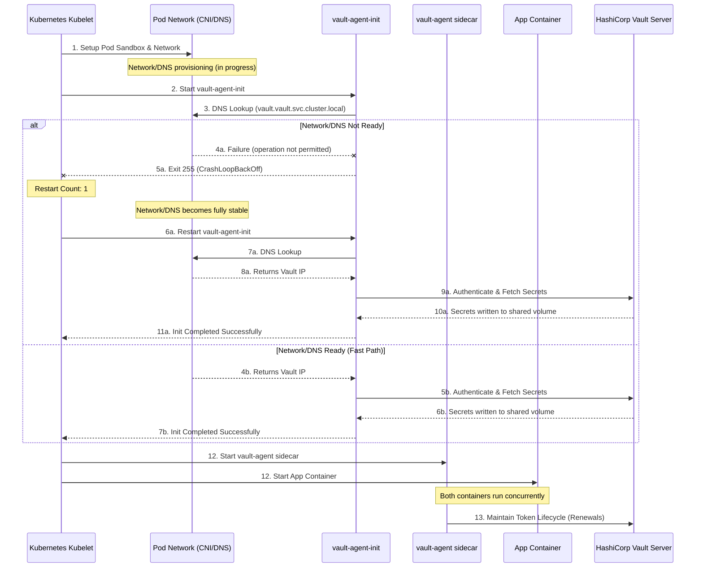

# Vault Agent Startup Sequence Diagram

```mermaid
sequenceDiagram
    participant Kubelet as Kubernetes Kubelet
    participant PodNet as Pod Network (CNI/DNS)
    participant Init as vault-agent-init
    participant Sidecar as vault-agent sidecar
    participant App as App Container
    participant Vault as HashiCorp Vault Server

    Kubelet->>PodNet: 1. Setup Pod Sandbox & Network
    note over PodNet: Network/DNS provisioning (in progress)
    
    Kubelet->>Init: 2. Start vault-agent-init
    Init->>PodNet: 3. DNS Lookup (vault.vault.svc.cluster.local)
    
    alt Network/DNS Not Ready
        PodNet--xInit: 4a. Failure (operation not permitted)
        Init--xKubelet: 5a. Exit 255 (CrashLoopBackOff)
        note over Kubelet: Restart Count: 1
        
        note over PodNet: Network/DNS becomes fully stable
        
        Kubelet->>Init: 6a. Restart vault-agent-init
        Init->>PodNet: 7a. DNS Lookup
        PodNet-->>Init: 8a. Returns Vault IP
        Init->>Vault: 9a. Authenticate & Fetch Secrets
        Vault-->>Init: 10a. Secrets written to shared volume
        Init-->>Kubelet: 11a. Init Completed Successfully
    else Network/DNS Ready (Fast Path)
        PodNet-->>Init: 4b. Returns Vault IP
        Init->>Vault: 5b. Authenticate & Fetch Secrets
        Vault-->>Init: 6b. Secrets written to shared volume
        Init-->>Kubelet: 7b. Init Completed Successfully
    end

    Kubelet->>Sidecar: 12. Start vault-agent sidecar
    Kubelet->>App: 12. Start App Container
    
    note over Sidecar, App: Both containers run concurrently
    Sidecar->>Vault: 13. Maintain Token Lifecycle (Renewals)
```
