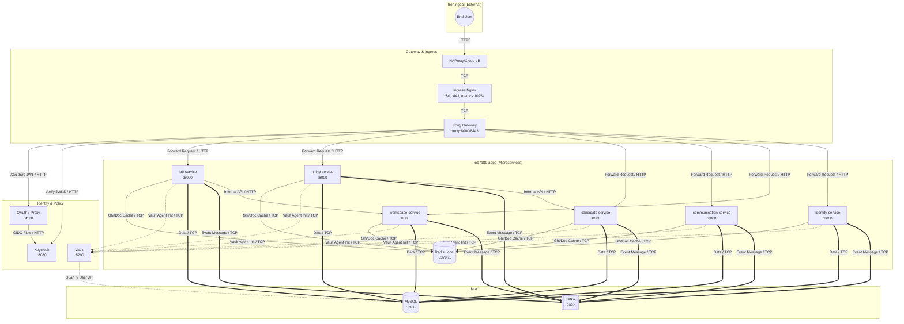
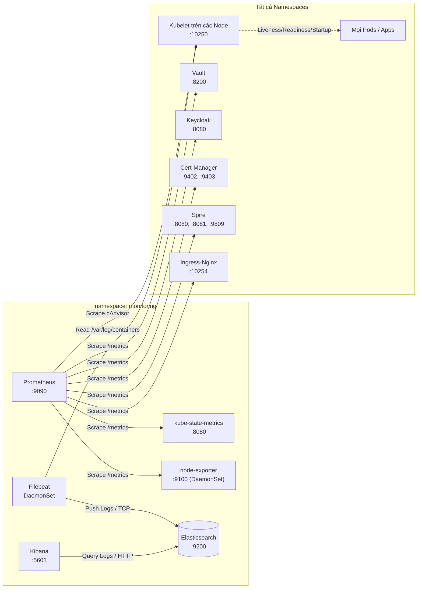
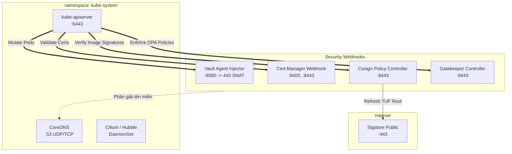
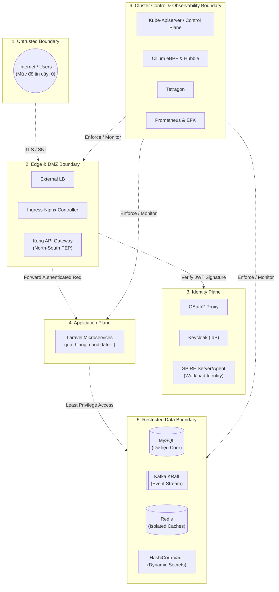
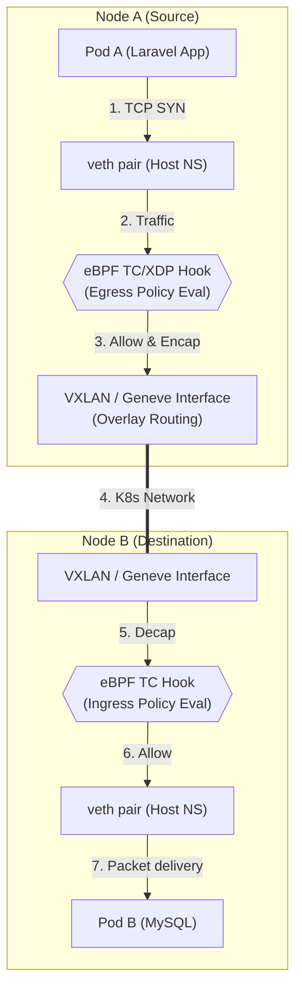

# Bản đồ Kiến trúc Mạng & Zero Trust Microsegmentation Blueprint

Tài liệu này là sự kết hợp giữa **Sơ đồ Luồng mạng Logic (Logical Flow)** và **Kiến trúc Bảo mật Zero Trust (Security Architecture)**. Mục đích là để làm "Source of Truth" tuyệt đối cho việc thiết lập và kiểm toán các chính sách mạng (CiliumNetworkPolicy), đồng thời đáp ứng tiêu chuẩn học thuật cho đồ án/luận văn.

---

## PHẦN I: SƠ ĐỒ LUỒNG MẠNG LOGIC (LOGICAL ARCHITECTURE)

Phần này liệt kê **100%** các luồng mạng giữa hơn 70 pods đang hoạt động trên 13 namespaces trong cụm Kubernetes.

### 1. Luồng Ứng dụng & Dữ liệu (Business & Data Flow)
Đây là luồng chính phục vụ người dùng cuối, bao gồm xác thực (N-S) và gọi dịch vụ nội bộ (E-W).

### 2. Luồng Quan sát & Giám sát (Observability Flow)
Giám sát metrics và logs từ **mọi pod** trong cụm.

### 3. Luồng Control Plane & Webhook (Security / Admission)
Mọi thao tác tạo Pod đều đi qua Kube-apiserver và bị kiểm duyệt.

---

## PHẦN II: ZERO TRUST MICROSEGMENTATION BLUEPRINT

Phần này tập trung vào các khái niệm cốt lõi của Zero Trust (Trust Boundaries, Identity, eBPF, Intent).

### 1. Zero Trust Boundaries (Ranh giới Tin cậy)
Tại mỗi điểm giao cắt giữa các ranh giới, lưu lượng mạng bắt buộc phải được kiểm tra (Inspect), xác thực (Authenticate) và cấp quyền (Authorize) theo nguyên tắc "Never trust, always verify".

### 2. Workload Identity & ServiceAccount Mapping
Cilium cấp quyền dựa trên **Identity**. Bảng dưới đây ánh xạ Danh tính Khối lượng công việc (Workload Identity).

| Workload | Namespace | Kubernetes SA | SPIFFE ID (mTLS Identity) | Ghi chú / Cấp độ rủi ro |
|---|---|---|---|---|
| `job-service` | `job7189-apps` | `job-service` | `spiffe://cluster.local/ns/job7189-apps/sa/job-service` | App nghiệp vụ / Medium |
| `identity-service` | `job7189-apps` | `identity-service` | `spiffe://cluster.local/ns/job7189-apps/sa/identity-service` | Xử lý User Data / High |
| `vault-agent-init` | `job7189-apps` | (Kế thừa từ App SA) | `spiffe://cluster.local/ns/job7189-apps/sa/*` | Sidecar lấy secret / Critical |
| `vault-0` | `vault` | `vault` | `spiffe://cluster.local/ns/vault/sa/vault` | Secret Engine / Critical |
| `keycloak` | `security` | `keycloak` | `spiffe://cluster.local/ns/security/sa/keycloak` | Core IdP / Critical |
| `kong` | `gateway` | `kong` | `spiffe://cluster.local/ns/gateway/sa/kong` | N-S Choke Point / High |
| `mysql` | `data` | `mysql` | `spiffe://cluster.local/ns/data/sa/mysql` | Storage / High |

### 3. Data Plane Enforcement Path (eBPF Hook Points)
Con đường thực tế của gói tin ở tầng hạ tầng mạng, minh họa cách Cilium áp dụng chính sách eBPF mà không cần dựa vào Kube-Proxy hay Iptables.

### 4. Phân tích Khối Lượng İş, Failed Domains & Blast Radius
| Thành phần bị xâm nhập (Compromised) | Blast Radius (Tầm ảnh hưởng) | Phương pháp Cô lập / Giảm thiểu (Mitigation) |
|---|---|---|
| **`job-service` pod** | Chỉ gọi được `job-service-redis`, `mysql` (qua Vault lease), `kafka` (produce event) và `workspace-service`. KHÔNG THỂ gọi các pod khác. | Egress Policy cực kỳ chặt chẽ (L4/L7). Redis độc lập cho từng App (Isolated Redis). Tự động thu hồi Secret Lease bằng Vault. |
| **`prometheus` pod** | Enumeration (liệt kê metrics hệ thống) và rò rỉ cấu hình (Leak Config). | Phân tách Namespace, hạn chế quyền RBAC của ServiceAccount (chỉ cho GET /metrics), cấm gọi ra Internet (No Egress World). |
| **`oauth2-proxy`** | Rủi ro bỏ qua xác thực (Auth Bypass) dẫn thẳng vào nội mạng. | Zero Trust Backend: Ngay cả khi qua Proxy, Kong và Backend vẫn kiểm tra JWT Signature (bằng JWKS Keycloak). Backend API không mù quáng tin tưởng Proxy. |
| **`cert-manager-webhook`** | Ngăn chặn cấp phát chứng chỉ mới (Denial of Service). | Hệ thống HA cho Webhook, các chứng chỉ cũ (dài hạn) vẫn hoạt động. Cần Policy L4 cho phép `kube-apiserver` gọi `:9403`. |

### 5. Ma trận Chính sách Mạng Intent-Based (Intent, Initiator, Protocol)
Phần này trả lời câu hỏi cốt lõi của Zero Trust: *"Tại sao được phép nói chuyện?"*

**A. Luồng Bắt buộc Hệ thống (Mandatory/Bootstrap Flows)**
| Source | Dest | Initiator | Flow Type | Protocol Semantics | Intent / Justification |
|---|---|---|---|---|---|
| Mọi Pod | `kube-dns` (`:53`) | Client | Bootstrap | UDP/TCP | Phân giải FQDN (ví dụ: external API, service khác). Cảnh giác lỗi L7 DNS Proxy. |
| `vault-agent` | `vault` (`:8200`) | Client | Bootstrap | HTTPS/TCP | Init container kéo DB/Redis credentials (JIT) trước khi app khởi động. |
| `spire-agent` | `spire-server` | Push | Operational | gRPC/TCP | Xác thực Node và workload, duy trì SVIDs. |

**B. Luồng Nghiệp Vụ Cốt Lõi (Core Business Flows)**
| Source | Dest | Initiator | Flow Type | Protocol Semantics | Intent / Justification |
|---|---|---|---|---|---|
| `ingress-nginx` | `kong` (`:8000`) | Client | Mandatory | HTTP/1.1 / TCP | Định tuyến traffic ngoài vào N-S PEP Gateway. |
| `kong` | `oauth2-proxy` | Pull/Auth | Mandatory | HTTP/1.1 | Kong forward check Auth Header để cấp phép user session. |
| `oauth2-proxy` | `keycloak` | Client | Mandatory | HTTP/1.1 | Lấy thông tin OIDC (OpenID Connect) và verify user token. |
| `kong` | `keycloak` | Pull | Mandatory | HTTP/1.1 | Lấy JWKS để tự verify JWT cục bộ mà không cần round-trip liên tục. |
| `kong` | Laravel Apps | Client | Mandatory | HTTP/1.1 | Đẩy request đã xác thực (có đính kèm JWT) vào Backend. |

**C. Luồng Dữ Liệu East-West (Data Flows)**
| Source | Dest | Initiator | Flow Type | Protocol Semantics | Intent / Justification |
|---|---|---|---|---|---|
| Laravel Apps | Tương ứng `*-redis` | Client | Mandatory | TCP (RESP) | Ghi/đọc Cache/Queue. **Isolated Redis**: Mỗi app có 1 Redis riêng biệt. |
| Laravel Apps | `mysql` (`:3306`) | Client | Mandatory | MySQL Protocol | Ghi/đọc dữ liệu. Truy cập được cấp bằng Vault Lease. |
| Laravel Apps | `kafka-0` (`:9092`) | Producer/Consumer | Mandatory | Kafka Binary | Async Event-Driven architecture (KRaft mode single-node). |
| `job-service` | `workspace-service` | Client | Operational | HTTP/REST | Luồng giao tiếp đồng bộ giữa 2 Domain giới hạn. |

**D. Luồng Điều khiển & Giám sát (Control & Observability Flows)**
| Source | Dest | Initiator | Flow Type | Protocol Semantics | Intent / Justification |
|---|---|---|---|---|---|
| `prometheus` | Mọi Endpoint | Pull | Operational | HTTP/1.1 (`/metrics`) | Cạo (Scrape) metrics từ mọi pod (Node, Apps, Vault...). |
| `filebeat` | `elasticsearch` | Push | Operational | TCP (`:9200`) | Đẩy logs từ các node về trung tâm lưu trữ. |
| Kubelet | Mọi Pod | Node | Operational | HTTP / TCP (Probes) | K8s Liveness/Readiness/Startup. *Không áp dụng L7 proxy cho probe.* |
| Hubble Agent | Hubble Relay | Push | Security | gRPC/TCP | Truyền network flow eBPF về UI để trực quan hóa bảo mật. |

**E. Luồng Phụ Thuộc Bên Ngoài (External Egress Dependencies)**
| Source | Dest | Initiator | Flow Type | Protocol Semantics | Intent / Justification |
|---|---|---|---|---|---|
| Laravel Apps | `smtp.gmail.com:587` | Push | Mandatory | SMTP/TCP | Gửi email thông báo cho người dùng. |
| `cosign-system` | Sigstore Public | Pull | Security | HTTPS/443 | Tải Root keys từ TUF để xác thực chữ ký của Image. |
| Kubelet / CRI | Internet | Pull | Bootstrap | HTTPS/443 | Pull Container Image từ registry (Docker Hub/GHCR) về Node. |
| CoreDNS | Upstream DNS | Pull | Operational | UDP/53 | Phân giải các tên miền không thuộc `.cluster.local`. |

### 6. Luồng Vận hành của Operator và Kubectl (Administrative Flows)
Một sai lầm phổ biến khi thiết lập Zero Trust là chặn mất đường quản trị. Các luồng sau phải được thiết kế dưới dạng **Administrative Flow**:

- **Kube-apiserver -> Webhooks:** (Cert-Manager, Vault Injector, Cosign, Gatekeeper). Kube-apiserver gọi vào webhook (`8443`, `9403`...).
- **Kube-apiserver -> Kubelet (10250):** Được gọi khi user thực hiện `kubectl exec`, `kubectl logs`, `port-forward`. 
- **Operator Reconciliation Loops:** Các Pod Operator (`cilium-operator`, `tetragon-operator`, `cert-manager`) liên tục theo dõi (Watch) API Server (`6443`) để phản hồi thay đổi cấu trúc K8s. 

---

## TỔNG KẾT HƯỚNG DẪN KỸ THUẬT CILIUM
Dựa vào Blueprint này, khi hiện thực hóa mã YAML của `CiliumNetworkPolicy`, hãy tuân thủ nguyên tắc:
1. **Khởi đầu bằng Deny All:** Cô lập hoàn toàn Namespace.
2. **Khoan lỗ có chủ đích (Pinhole Egress):** Bắt buộc có rule mở CoreDNS (L4), Vault (L4), và Kube-apiserver cho các pods khởi động cơ bản.
3. **Mở luồng Ingress cho Control Plane:** Bắt buộc có rule Ingress cho phép Kubelet thực hiện Probes và Prometheus cạo Metrics để tránh hệ thống "chết chìm trong im lặng".
4. **Cô lập theo Workload, không theo Namespace:** Ví dụ: Chỉ dán nhãn `matchLabels: {app: job-service}` mới được quyền egress tới `app: job-service-redis`. 
5. **Giám sát vi phạm:** Bật Tetragon để cảnh báo process mở mạng không mong muốn, và phân tích `policy-verdict: drop` trên Hubble UI/Relay.

---

### PHỤ LỤC: NHỮNG BÀI HỌC VÀ NGOẠI LỆ THỰC TẾ TRONG QUÁ TRÌNH TRIỂN KHAI

Sau khi áp dụng Zero Trust và test trực tiếp với Hubble, một số ngoại lệ mạng (edge cases) được ghi nhận và cần tuân thủ khi viết Policy:

1. **HostNetwork Pods (ví dụ: Filebeat, Node Exporter):** 
   - Khi một pod chạy dưới dạng `hostNetwork: true`, nó kế thừa IP của Node. 
   - **Xử lý:** Cilium sẽ gán identity là `host` và `remote-node` thay vì identity của Pod. Các rule `ingress` cho Elasticsearch bắt buộc phải cho phép `fromEntities: [host, remote-node]` để nhận log từ Filebeat.
2. **Prometheus Scraping:** 
   - Prometheus cần được cấp quyền Egress rộng rãi để quét toàn bộ Cluster (bao gồm cả kube-apiserver và các Node).
   - Label trên pod của Prometheus có thể là `app: prometheus`, cần soi thật kỹ bằng lệnh `kubectl get pod --show-labels` thay vì đoán nhãn `serviceaccount` mặc định của Cilium.
3. **Kube-State-Metrics:**
   - Tương tự Prometheus, KSM cần giao tiếp với `kube-apiserver` (port 6443) để list/watch toàn bộ tài nguyên. Cần mở explicit Egress tới thực thể `kube-apiserver`.
4. **Bypass DNS L7 Proxy (Lỗi Timeout):**
   - Không áp dụng L7 DNS Proxy (FQDN match) nếu không thực sự cần thiết, vì nó thường gây nghẽn và rớt gói tin DNS. Sử dụng L4 UDP/TCP port 53 thuần túy cho luồng nội bộ.
5. **Gateway Ingress Controller (`ingress-nginx`):**
   - Các controller từ bên ngoài vào luôn bị chặn chiều Ingress, trừ khi bạn cho phép explicit `fromEntities: [world, host, remote-node]`. Chú ý khi test `curl` từ trong cluster (qua pod), luồng có thể bị drop do nó không đến từ `world`! Thử nghiệm phải đi từ đúng Gateway.
