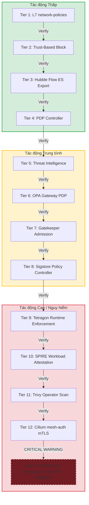

# Kế hoạch Cập nhật & Rollback các Thành phần Bảo mật ZTA (Zero Trust Architecture)

Kế hoạch này hệ thống hóa toàn bộ các hoạt động nâng cấp bảo mật và quy trình hoàn trả (rollback) cho hệ thống, sắp xếp theo thứ tự từ **ít tác động nhất (Least Disruptive / Low Impact)** đến **tác động nhiều nhất (Most Disruptive / High & Critical Impact)**.

Quy trình này giúp đảm bảo tính ổn định của cụm Kubernetes (đặc biệt trong môi trường giới hạn tài nguyên RAM và chạy trên mạng Tailscale của node `7189srv05`), tránh xung đột định tuyến và sự cố Out-Of-Memory (OOM).

---

## Sơ đồ Tổng quan Tiến trình Nâng cấp



---

## Chi tiết các Bước Cập nhật và Rollback

### Tác động Thấp (Low Impact)

#### Tier 1: L7 Network Security Policies (Allowlists)
* **Mô tả**: Áp dụng các chính sách mạng Cilium L7 (CNPs) để lọc và giới hạn quyền truy cập ở tầng HTTP/application đối với các endpoint nhạy cảm (Vault API, Keycloak OIDC, Prometheus metrics).
* **Đánh giá Rủi ro**: **Rất thấp**. Chỉ chặn các gói tin không hợp lệ ở tầng ứng dụng, không ảnh hưởng đến định tuyến mạng tổng thể hoặc hiệu năng CPU/RAM.
* **Tập tin liên quan**:
  * [scripts/zta-apply-l7-policies.sh](file:///home/ptb/projects/DATN/scripts/zta-apply-l7-policies.sh)
  * Thư mục chứa CNP: `infras/k8s-yaml/cilium-policies/l7/`
* **Lệnh Cập nhật**:
  ```bash
  bash scripts/zta-apply-l7-policies.sh --apply
  ```
* **Lệnh Rollback**:
  ```bash
  bash scripts/zta-apply-l7-policies.sh --delete
  ```
* **Cách Kiểm tra (Verify)**:
  * Chạy test: `bash 09-verify-zta.sh`
  * Kết quả mong muốn: **Test 4e: L7 Policy Coverage (5W1H)** báo `PASS`.

---

#### Tier 2: Trust-Based Block Policy (`cnp-block-low-trust-to-vault`)
* **Mô tả**: Áp dụng rule chặn các pod có điểm tin cậy thấp (`score-bucket` là `low` hoặc `medium`) truy cập vào Vault để lấy database credentials.
* **Đánh giá Rủi ro**: **Thấp**. Hoạt động dựa trên nhãn động do PDP gán. Nếu pod chạy bình thường có điểm tin cậy cao (`high`), kết nối hoàn toàn không bị ảnh hưởng.
* **Tập tin liên quan**:
  * [17-cnp-block-low-trust-to-vault.yaml](file:///home/ptb/projects/DATN/infras/k8s-yaml/cilium-policies/namespaces/17-cnp-block-low-trust-to-vault.yaml)
* **Lệnh Cập nhật**:
  ```bash
  kubectl apply -f infras/k8s-yaml/cilium-policies/namespaces/17-cnp-block-low-trust-to-vault.yaml
  ```
* **Lệnh Rollback**:
  ```bash
  kubectl delete -f infras/k8s-yaml/cilium-policies/namespaces/17-cnp-block-low-trust-to-vault.yaml --ignore-not-found
  ```
* **Cách Kiểm tra (Verify)**:
  * Chạy test: `bash 09-verify-zta.sh`
  * Kết quả mong muốn: **Test 4o (mục 2)** báo `PASS` (CNP cnp-block-low-trust-to-vault enforcing in vault namespace).

---

#### Tier 3: Hubble Flow Export to Elasticsearch (Audit Trail)
* **Mô tả**: Kích hoạt ghi log luồng mạng mạng (Network flow) ở tầng eBPF của Cilium ra file trên đĩa cứng và triển khai DaemonSet Filebeat (`hubble-flow-shipper`) để đẩy log về Elasticsearch làm nhật ký giám sát bảo mật.
* **Đánh giá Rủi ro**: **Thấp - Trung bình**. Việc khởi động shipper tiêu tốn khoảng 100-200MiB RAM mỗi node (tổng ~400-800MiB RAM trên toàn cụm 4 node). Có rủi ro nhỏ khi restart Cilium agents nếu bật tính năng export file của Cilium.
* **Tập tin liên quan**:
  * [scripts/zta-deploy-hubble-export.sh](file:///home/ptb/projects/DATN/scripts/zta-deploy-hubble-export.sh)
  * Thư mục cấu hình: `infras/k8s-yaml/hubble-export/`
* **Lệnh Cập nhật**:
  * *Chỉ cài shipper (khuyên dùng khi cluster tải cao)*:
    ```bash
    bash scripts/zta-deploy-hubble-export.sh
    ```
  * *Bật đầy đủ (gồm cấu hình xuất file từ Cilium + restart Cilium)*:
    ```bash
    bash scripts/zta-deploy-hubble-export.sh --enable-cilium-export
    ```
* **Lệnh Rollback**:
  ```bash
  bash scripts/zta-deploy-hubble-export.sh --uninstall
  ```
* **Cách Kiểm tra (Verify)**:
  * Chạy test: `bash 09-verify-zta.sh`
  * Kết quả mong muốn: **Test 4l: Hubble flow → Elasticsearch (audit trail)** báo `PASS`.

---

#### Tier 4: PDP Controller (Adaptive Loop)
* **Mô tả**: Triển khai bộ điều khiển PDP (Policy Decision Point) chạy bằng Python để thu thập báo cáo lỗ hổng từ cụm và tự động cập nhật nhãn `cilium.zta/score-bucket` cho các pod.
* **Đánh giá Rủi ro**: **Trung bình**. PDP chạy độc lập và không can thiệp trực tiếp vào kết nối mạng của microservices. Tuy nhiên, nếu PDP đánh giá sai điểm tin cậy và gán nhãn `low` cho một pod đang hoạt động bình thường, pod đó có thể bị Tier 2 chặn truy cập Vault dẫn tới mất kết nối Database.
* **Tập tin liên quan**:
  * [scripts/zta-deploy-pdp.sh](file:///home/ptb/projects/DATN/scripts/zta-deploy-pdp.sh)
  * Python Controller: [pdp_controller.py](file:///home/ptb/projects/DATN/infras/pdp/pdp_controller.py)
  * Thư mục K8s manifests: `infras/k8s-yaml/pdp/`
* **Lệnh Cập nhật**:
  ```bash
  bash scripts/zta-deploy-pdp.sh
  ```
* **Lệnh Rollback**:
  ```bash
  bash scripts/zta-deploy-pdp.sh --uninstall
  ```
* **Cách Kiểm tra (Verify)**:
  * Chạy test: `bash 09-verify-zta.sh`
  * Kết quả mong muốn: **Test 4g: PDP Controller** báo `PASS`.

---

### Tác động Trung bình (Medium Impact)

#### Tier 5: Threat Intelligence Feeds Integration
* **Mô tả**: Thiết lập CronJob tải danh sách IP/Domain độc hại từ các nguồn cấp quốc tế (FireHOL, URLhaus). Tích hợp chặn IP độc hại bằng `CiliumCIDRGroup` (`cnp-threat-intel-egress-deny`) và chặn Domain độc hại bằng cách patch CoreDNS sinkhole (Splice plugin `hosts` vào Corefile và mount ConfigMap).
* **Đánh giá Rủi ro**: **Trung bình**. Quá trình cập nhật cấu hình CoreDNS sẽ thực hiện rolling restart các pod `coredns` trong namespace `kube-system`. Việc này có thể gây trễ phân giải DNS trong cụm khoảng vài giây.
* **Tập tin liên quan**:
  * [scripts/zta-deploy-threat-intel.sh](file:///home/ptb/projects/DATN/scripts/zta-deploy-threat-intel.sh)
  * Thư mục K8s manifests: `infras/k8s-yaml/threat-intel/`
* **Lệnh Cập nhật**:
  ```bash
  bash scripts/zta-deploy-threat-intel.sh
  ```
* **Lệnh Rollback**:
  ```bash
  bash scripts/zta-deploy-threat-intel.sh --uninstall
  ```
* **Cách Kiểm tra (Verify)**:
  * Chạy test: `bash 09-verify-zta.sh`
  * Kết quả mong muốn: **Test 4n: Threat Intelligence Feeds** báo `PASS`.

---

#### Tier 6: OPA (Open Policy Agent) Gateway PDP
* **Mô tả**: Triển khai OPA tích hợp vào API Gateway (Kong) để xác thực và phân quyền người dùng (JWT claims validation).
* **Đánh giá Rủi ro**: **Trung bình - Cao**. OPA đứng trên luồng dữ liệu truy cập trực tiếp từ trình duyệt của người dùng (từ Internet/frontend qua Kong vào backend). Nếu cấu hình sai policy Rego hoặc OPA pods gặp lỗi, toàn bộ API của hệ thống sẽ trả về lỗi `500` hoặc `403/401`.
* **Tập tin liên quan**:
  * [scripts/zta-deploy-opa.sh](file:///home/ptb/projects/DATN/scripts/zta-deploy-opa.sh)
  * Thư mục chứa policy: `infras/k8s-yaml/opa/policies/`
* **Lệnh Cập nhật**:
  * *Nâng cấp/Cài mới*:
    ```bash
    bash scripts/zta-deploy-opa.sh
    ```
  * *Chỉ cập nhật policy Rego (không restart OPA)*:
    ```bash
    bash scripts/zta-deploy-opa.sh --policies-only
    ```
* **Lệnh Rollback**:
  ```bash
  bash scripts/zta-deploy-opa.sh --uninstall
  ```
* **Cách Kiểm tra (Verify)**:
  * Chạy test: `bash 09-verify-zta.sh`
  * Kết quả mong muốn: **Test 3: Kong JWT Enforcement** báo `PASS` (Protected route returns 401 without JWT).

---

#### Tier 7: Gatekeeper Policy Enforcement (Admission Webhook)
* **Mô tả**: Cài đặt OPA Gatekeeper để kiểm soát và thực thi các ràng buộc bảo mật (ConstraintTemplates/Constraints) tại thời điểm khởi tạo tài nguyên Kubernetes (ví dụ: cấm dùng image không chỉ định digest, yêu cầu gán đầy đủ nhãn ZTA).
* **Đánh giá Rủi ro**: **Trung bình - Cao**. Gatekeeper đăng ký làm Validating Webhook với Kubernetes API Server. Nếu cấu hình sai rule hoặc Gatekeeper bị treo, bạn sẽ không thể tạo mới, cập nhật hoặc xóa bất kỳ pod/deployment nào trong cụm.
* **Tập tin liên quan**:
  * [scripts/zta-deploy-gatekeeper.sh](file:///home/ptb/projects/DATN/scripts/zta-deploy-gatekeeper.sh)
  * Thư mục K8s templates & constraints: `infras/k8s-yaml/gatekeeper/`
* **Lệnh Cập nhật**:
  ```bash
  bash scripts/zta-deploy-gatekeeper.sh
  ```
* **Lệnh Rollback**:
  ```bash
  bash scripts/zta-deploy-gatekeeper.sh --uninstall
  ```
* **Cách Kiểm tra (Verify)**:
  * Chạy test: `bash 09-verify-zta.sh`
  * Kết quả mong muốn: **Test 4f (phần Gatekeeper)** báo `PASS`.

---

#### Tier 8: Sigstore Policy Controller
* **Mô tả**: Triển khai admission controller của Sigstore để xác thực chữ ký số ảnh container (Cosign signature validation) khi pod được deploy vào cụm, đảm bảo ảnh container đến từ nguồn tin cậy được ký bởi khóa nội bộ.
* **Đánh giá Rủi ro**: **Trung bình - Cao**. Hoạt động dưới dạng Validating Webhook. Nếu mất khóa công khai (public key) hoặc cấu hình sai chính sách `ClusterImagePolicy`, Kubernetes sẽ từ chối kéo tất cả các ảnh container và không thể khởi động pod mới.
* **Tập tin liên quan**:
  * [scripts/zta-deploy-policy-controller.sh](file:///home/ptb/projects/DATN/scripts/zta-deploy-policy-controller.sh)
  * Thư mục K8s manifests: `infras/k8s-yaml/sigstore/`
* **Lệnh Cập nhật**:
  ```bash
  bash scripts/zta-deploy-policy-controller.sh
  ```
* **Lệnh Rollback**:
  ```bash
  bash scripts/zta-deploy-policy-controller.sh --uninstall
  ```
* **Cách Kiểm tra (Verify)**:
  * Chạy test: `bash 09-verify-zta.sh`
  * Kết quả mong muốn: **Test 4j: sigstore policy-controller** báo `PASS`.

---

### Tác động Cao & Nguy hiểm (High & Critical Impact)

#### Tier 9: Tetragon Runtime Security Enforcement
* **Mô tả**: Triển khai tác nhân Tetragon (DaemonSet trên tất cả các node) để giám sát và thực thi an toàn mức runtime ở tầng nhân Linux (kernel) thông qua eBPF (giám sát ghi tệp nhạy cảm, thực thi lệnh trong container, namespace escapes).
* **Đánh giá Rủi ro**: **Cao**. Tetragon can thiệp sâu vào tầng nhân hệ điều hành. Việc cài đặt/gỡ bỏ không đúng cách hoặc xảy ra lỗi biên dịch eBPF trên phiên bản kernel cũ có thể gây treo hệ thống host hoặc làm CrashLoop các dịch vụ hệ thống quan trọng.
* **Tập tin liên quan**:
  * [10-deploy-tetragon.sh](file:///home/ptb/projects/DATN/10-deploy-tetragon.sh)
  * Thư mục manifests: `infras/k8s-yaml/tetragon/`
* **Lệnh Cập nhật**:
  ```bash
  bash 10-deploy-tetragon.sh
  ```
* **Lệnh Rollback**:
  ```bash
  helm uninstall tetragon -n kube-system
  ```
* **Cách Kiểm tra (Verify)**:
  * Chạy test: `bash 09-verify-zta.sh`
  * Kết quả mong muốn: **Test 4f (phần Tetragon)** và **Test 4q (phần Tetragon scrape)** báo `PASS`.

---

#### Tier 10: SPIRE Workload Attestation & SVID Rotation
* **Mô tả**: Triển khai SPIRE Server (StatefulSet) và SPIRE Agent (DaemonSet) cùng SPIFFE CSI Driver để định danh và cấp phát chứng chỉ bảo mật (SVID) ngắn hạn cho các workload trong cụm.
* **Đánh giá Rủi ro**: **Cao**.
  * Tiêu tốn tương đối nhiều RAM (~1.2 GiB RAM trên toàn cụm).
  * Việc cấp lại định danh có thể gây gián đoạn các kết nối dịch vụ sử dụng giao thức mTLS nếu các pod chưa kịp cập nhật SVID mới từ Workload API.
* **Tập tin liên quan**:
  * [scripts/zta-deploy-spire.sh](file:///home/ptb/projects/DATN/scripts/zta-deploy-spire.sh)
  * Thư mục cấu hình: `infras/k8s-yaml/spire/`
* **Lệnh Cập nhật**:
  * *Cập nhật tiêu chuẩn*:
    ```bash
    bash scripts/zta-deploy-spire.sh
    ```
  * *Cài đặt lại sạch (khuyên dùng khi SPIRE bị lỗi không đồng bộ)*:
    ```bash
    bash scripts/zta-deploy-spire.sh --reset
    ```
* **Lệnh Rollback**:
  ```bash
  bash scripts/zta-deploy-spire.sh --uninstall
  ```
* **Cách Kiểm tra (Verify)**:
  * Chạy test: `bash 09-verify-zta.sh`
  * Kết quả mong muốn: **Test 4i: SPIRE Workload Attestation** và **Test 4k: SPIRE Workload Integration** báo `PASS`.

---

#### Tier 11: Trivy Operator (Continuous Container Scan)
* **Mô tả**: Triển khai Trivy Operator để quét liên tục các lỗ hổng bảo mật trong ảnh container và các lỗi cấu hình trong cụm.
* **Đánh giá Rủi ro**: **Cao (Disruptive do giới hạn RAM)**.
  > [▼ WARNING]
  > Quá trình quét và tải cơ sở dữ liệu lỗ hổng (Trivy DB) diễn ra đồng thời cho nhiều pod sẽ tạo ra các đỉnh tải cực lớn về bộ nhớ RAM (lên tới ~1500 MiB RAM). Trên máy chủ lab giới hạn tài nguyên, điều này sẽ kích hoạt OOM Killer của Linux, giết chết các tiến trình cốt lõi của Kubernetes (kubelet, apiserver) dẫn tới việc rớt kết nối cụm và CrashLoop toàn bộ các node.

* **Giải pháp giảm thiểu rủi ro**:
  * Thiết lập giới hạn chạy song song các tiến trình quét về tối thiểu (`scanJobsConcurrentLimit=1` trong values).
  * Giảm thiểu RAM gate kiểm tra tài nguyên khi cài đặt thông qua biến môi trường nếu có cơ chế Swap hỗ trợ.
* **Tập tin liên quan**:
  * [scripts/zta-deploy-trivy.sh](file:///home/ptb/projects/DATN/scripts/zta-deploy-trivy.sh)
  * Thư mục manifests: `infras/k8s-yaml/trivy-operator/`
* **Lệnh Cập nhật**:
  ```bash
  TRIVY_REQUIRED_HOST_MI=800 bash scripts/zta-deploy-trivy.sh
  ```
* **Lệnh Rollback**:
  ```bash
  bash scripts/zta-deploy-trivy.sh --uninstall
  ```
* **Cách Kiểm tra (Verify)**:
  * Chạy test: `bash 09-verify-zta.sh`
  * Kết quả mong muốn: **Test 4m: CDM — Trivy Operator (PIP 4)** báo `PASS`.

---

#### Tier 12: Cilium Mutual Authentication (mTLS sidecarless)
* **Mô tả**: Kích hoạt tính năng xác thực lẫn nhau (mTLS) ở tầng mạng eBPF của Cilium dựa trên nhận diện SPIFFE từ SPIRE mà không cần sidecar proxy (như Envoy/Linkerd).
* **Đánh giá Rủi ro**: **Rất cao (Highly Disruptive)**.
  * Việc này buộc phải cập nhật tệp cấu hình toàn cụm `cilium-config` và thực hiện rolling restart toàn bộ tác nhân mạng `ds/cilium` trên tất cả các node.
  * Trong quá trình restart, các kết nối mạng giữa các pod sẽ bị ngắt tạm thời để cấu hình lại định tuyến eBPF. Các giao dịch đang xử lý dở dang có thể bị lỗi nếu không có cơ chế tự động thử lại (retry).
* **Tập tin liên quan**:
  * [08-harden-security.sh](file:///home/ptb/projects/DATN/08-harden-security.sh)
* **Lệnh Cập nhật**:
  ```bash
  ZTA_HARDEN_WIREGUARD=0 bash 08-harden-security.sh
  ```
* **Lệnh Rollback**:
  ```bash
  # Tắt mesh-auth trong configmap và restart lại daemonset Cilium
  kubectl -n kube-system patch configmap cilium-config --type merge -p '{"data":{"mesh-auth-enabled":"false"}}'
  kubectl -n kube-system rollout restart ds/cilium
  kubectl -n kube-system rollout status ds/cilium -n kube-system
  ```
* **Cách Kiểm tra (Verify)**:
  * Chạy test: `bash 09-verify-zta.sh`
  * Kết quả mong muốn: **Test 5: Encryption Status (mTLS)** báo `PASS`.

---

#### Tier 13: WireGuard Transparent Encryption (Cilium)
* **Mô tả**: Mã hóa toàn bộ dữ liệu truyền giữa các pod ở tầng nhân thông qua giao thức WireGuard tích hợp trong Cilium.
* **Đánh giá Rủi ro**: **Nghiêm trọng (Critical / Blocked)**.
  > [▼ CAUTION]
  > **KHÔNG ĐƯỢC BẬT tính năng này trong môi trường mạng hiện tại!**
  > Máy chủ hiện đang sử dụng mạng riêng ảo **Tailscale** để định tuyến và kết nối giữa các thành phần. Việc bật thêm mã hóa WireGuard ở tầng Cilium đè lên mạng Tailscale (vốn cũng dựa trên WireGuard) sẽ dẫn đến xung đột bảng định tuyến cục bộ, tạo vòng lặp gói tin (routing loops) và làm mất kết nối hoàn toàn của node `7189srv05`. Quy trình hoàn trả khi mất kết nối qua Tailscale sẽ cực kỳ khó khăn do không thể SSH từ xa.

* **Lệnh Rollback khẩn cấp (Nếu vô tình bật)**:
  Nếu lỡ kích hoạt và mất mạng Tailscale, bạn phải truy cập trực tiếp bằng thiết bị đầu cuối vật lý (hoặc console cục bộ của VM) và chạy lệnh:
  ```bash
  kubectl -n kube-system patch configmap cilium-config --type merge -p '{"data":{"enable-wireguard":"false"}}'
  kubectl -n kube-system rollout restart ds/cilium
  kubectl -n kube-system rollout status ds/cilium -n kube-system
  ```

---

## Kế hoạch Xác thực Toàn diện (Comprehensive Verification Plan)

Sau khi thực hiện bất kỳ nâng cấp hoặc rollback nào, bạn phải chạy kịch bản kiểm tra tự động để xác nhận toàn bộ hệ thống vẫn vận hành an toàn:

### 1. Chạy Kịch bản Xác thực ZTA Tự động
```bash
bash 09-verify-zta.sh
```
*Hãy theo dõi kỹ kết quả đầu ra của từng test suite từ Test 1 đến Test 7.*

### 2. Kiểm tra Kết nối API Dịch vụ
Để chắc chắn API gateway và các microservices Laravel hoạt động bình thường, hãy chạy script kiểm tra API:
```bash
python3 test_api.py
```
*Kết quả mong muốn: Tất cả các endpoint trả về mã HTTP hợp lệ (200 OK hoặc phản hồi nghiệp vụ tương ứng), không có lỗi 502/504 từ cổng Kong.*

### 3. Kiểm tra Trạng thái Tài nguyên Kubernetes
```bash
kubectl get pods -A
kubectl get nodes -o wide
```
*Đảm bảo không có pod nào rơi vào trạng thái `CrashLoopBackOff` hoặc `OOMKilled`.*
