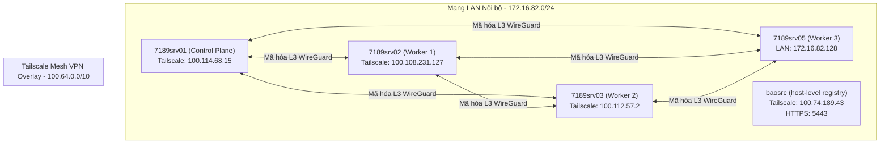

# Kiến trúc Vật lý & Luồng Dữ liệu Mạng ZTA (NIST 1800-35 §3.5)

> **Cập nhật chuẩn 2026-06-20:** trạng thái cluster mới nhất xem
> `00-SYSTEM-SNAPSHOT.md`. File này đã reconcile các mâu thuẫn lớn về Tetragon,
> registry, PDP namespace và OS.

Tài liệu này chi tiết hóa cấu trúc hạ tầng vật lý, mạng ảo hóa (overlay) và sự phân tách giữa Control Plane và Data Plane trong cụm Zero Trust Laboratory của đồ án (đối chiếu tiêu chuẩn NIST SP 1800-35 §3.5).

---

## 1. Sơ đồ Kiến trúc Vật lý & Workload Placement (Node Mapping)

Hệ thống được chạy trên **4 máy ảo (VMs)** kết nối qua mạng cục bộ (LAN) và thiết lập mạng mesh VPN mã hóa bằng **Tailscale Overlay**. Theo `kubectl get nodes -o wide` khi cluster bật lại: `7189srv01`/`7189srv02`/`7189srv03` chạy **Debian GNU/Linux 13 (trixie)**; `7189srv05` chạy **Ubuntu 24.04.4 LTS**.



### Bản đồ Phân bổ Workload (Workload-to-Node Mapping)
Do hạn chế về RAM vật lý (15.5 GiB tổng), các pod được lập lịch phân tán trên các node để tối ưu hóa hiệu năng:

*   **`7189srv01` (Control Plane)**: 
    *   Kubernetes Control Plane (api-server, controller-manager, scheduler, etcd).
    *   SPIRE Server (`spire-server-0`).
*   **`7189srv02` (Worker 1)**:
    *   Nginx Ingress Controller (`ingress-nginx-controller`).
    *   Kong API Gateway (`kong-gateway`).
    *   Keycloak (`keycloak`).
*   **`7189srv03` (Worker 2)**:
    *   Các microservices ứng dụng (`identity-service`, `job-service`, `candidate-service`...).
    *   Trivy Operator (`trivy-operator`).
*   **`7189srv05` (Worker 3)**:
    *   Phân vùng lưu trữ dữ liệu: MySQL (`mysql`), Kafka (`kafka-0`), HashiCorp Vault (`vault-0`).
    *   Bộ điều khiển PDP (`zta-pdp`) chạy trong namespace `security`.

**DaemonSet toàn cụm:** Tetragon v1.7.0 chạy dạng DaemonSet trên mọi worker đang schedule được (trạng thái 2026-06-20: `3/3` trong `kube-system`), không phải thành phần riêng của `srv01`. Kiểm chứng: `kubectl -n kube-system get ds tetragon -o wide`.

**Docker Registry:** registry hiện là **host-level registry** chạy trên máy `baosrc` qua HTTPS `https://100.74.189.43:5443`, không phải pod in-cluster và không phải `srv03`. Namespace Kubernetes `registry` tồn tại nhưng rỗng. Kiểm chứng: `curl -k https://100.74.189.43:5443/v2/_catalog` và `kubectl -n registry get pod,svc,deploy,sts,ds,job,cronjob`.

---

## 2. Phân tách Control Plane và Data Plane (NIST 800-207 §3.4)

Tuân thủ Tenet của NIST 800-207, toàn bộ lưu lượng mạng được tách biệt rõ ràng giữa kênh quyết định chính sách (Control Plane) và kênh trao đổi dữ liệu thực tế (Data Plane):

```
                        ┌────────────────────────────────────────────────┐
                        │            CONTROL PLANE (Vùng Kênh dọc)       │
                        │  - Kube-API Server (6443)                      │
                        │  - Keycloak Auth Flow                          │
                        │  - SPIRE Agent Attestation                     │
                        │  - Vault Secrets Fetching                      │
                        └───────────────────────┬────────────────────────┘
                                                │
                                                │  (Cấp SVIDs / Ra Quyết định)
                                                ▼
┌───────────────────────────────────────────────────────────────────────────────────────┐
│                       DATA PLANE (Vùng Kênh ngang - eBPF Datapath)                    │
│                                                                                       │
│  [Kong Gateway] ──(mTLS / Port 8000)──> [identity-service] ──(TCP:3306)──> [MySQL]    │
│         ▲                                       ▲                                     │
│         │ (eBPF Intercept)                      │ (eBPF Intercept)                    │
│         ▼                                       ▼                                     │
│  [Cilium Envoy Proxy]                    [Cilium Envoy Proxy]                         │
└───────────────────────────────────────────────────────────────────────────────────────┘
```

*   **Control Plane**:
    *   **SPIRE Server/Agent**: Thực hiện chứng thực Workload qua Unix Domain Socket (`csi.spiffe.io`) cấp SVID dạng X.509 certificate hoặc JWT token.
    *   **HashiCorp Vault Agent**: Nhận JWT token từ SPIRE, trao đổi lấy App Token để giải mã file cấu hình mật `.env` lưu trong RAM ảo (`tmpfs`).
    *   **Keycloak**: Cấp ID Token/Access Token (OIDC Flow) cho người dùng đăng nhập qua cổng bảo vệ Ingress.
*   **Data Plane**:
    *   Được điều phối hoàn toàn bởi **Cilium eBPF Datapath** ở mức Linux Kernel.
    *   Khi `identity-service` gọi `MySQL`, gói tin bị intercept bởi chương trình eBPF được nạp vào socket, kiểm tra quyền truy cập trên bảng map (identity-based) và chuyển tiếp trực tiếp ở mức kernel mà không cần đi qua giao thức TCP/IP truyền thống chậm chạp.
    *   Lưu lượng L7 (như gRPC/HTTP OID/JWKS) đi qua **Cilium Envoy Proxy (TPROXY)** được chèn tự động ở mức data-path để thực thi L7 Rules.

---

## 3. Luồng đi của Gói tin: Tailscale CGNAT + Cilium VXLAN Routing

Khi một ứng viên bên ngoài Internet gửi yêu cầu xem danh sách công việc (`GET /api/public/jobs`) qua đường truyền ZTA:

```
[Người dùng Internet]
      │
      ▼
[Cloudflare Edge Node] (https://precise-boolean-sprint.trycloudflare.com)
      │
      ▼ (Cloudflared Tunnel)
[7189srv02 Host (100.108.231.127)] -- cổng tunnel dịch sang localhost:18000
      │
      ▼ (Port-Forward / DNAT)
[Kong Proxy Service (Namespace: gateway)] -- cổng NodePort 30000
      │
      ▼ (eBPF Routing / Socket-level LB)
[job-service Pod (Node: 7189srv03, Namespace: job7189-apps, IP: 10.244.2.15)]
      │
      ▼ (Cilium Egress Policy Check)
[mysql Pod (Node: 7189srv05, Namespace: data, IP: 10.244.3.40)]
```

### Mô tả chi tiết Luồng định tuyến:
1.  **Ingress Entry**: Cloudflare Tunnel nhận gói tin từ Edge và chuyển về tiến trình `cloudflared` chạy trên máy chủ `7189srv02` (Worker 1).
2.  **Edge PEP**: Tiến trình tunnel forward gói tin vào cổng NodePort `30000` của Kong Gateway Service. eBPF program của Cilium bắt được kết nối mới, thực hiện Socket-level Load Balancing và định tuyến gói tin thẳng đến Pod đầu tiên của `kong-gateway` (tránh nghẽn qua kube-proxy iptables).
3.  **Cross-Node eBPF Tunneling**: Kong Gateway thực hiện phân giải route `/api/public/jobs` và chuyển tiếp đến `job-service`.
    *   Do `job-service` nằm trên node `7189srv03` khác vật lý với Kong, Cilium thực hiện đóng gói gói tin gốc vào một khung **VXLAN tunnel** (hoặc định tuyến trực tiếp qua Tailscale WireGuard overlay).
    *   Gói tin rời card mạng Tailscale của `srv02` (IP `100.108.231.127`) sang card mạng Tailscale của `srv03` (IP `100.112.57.2`) qua kênh WireGuard được mã hóa hoàn toàn.
4.  **Pod Delivery**: Khi gói tin đến `srv03`, eBPF program tháo vỏ VXLAN và chuyển tiếp trực tiếp vào card mạng ảo `lxcxxx` của Pod `job-service`.
5.  **Database Query (Segmented Access)**: `job-service` gửi truy vấn SQL đến `MySQL` trên node `srv05`. 
    *   Cilium kiểm tra chính sách [10-data.yaml](file:///home/ptb/projects/DATN/infras/k8s-yaml/cilium-policies/namespaces/10-data.yaml) để xác nhận Pod có nhãn `job-service` được phép truy cập MySQL trên cổng 3306.
    *   Đồng thời, PDP Controller đã xác nhận Pod `job-service` không có Critical CVE và đủ 6 nhãn ZTA $\rightarrow$ gán nhãn `zta.job7189/score-bucket=high`.
    *   Chính sách `cnp-block-low-trust` thông qua $\rightarrow$ Kết nối SQL được thiết lập thành công.
