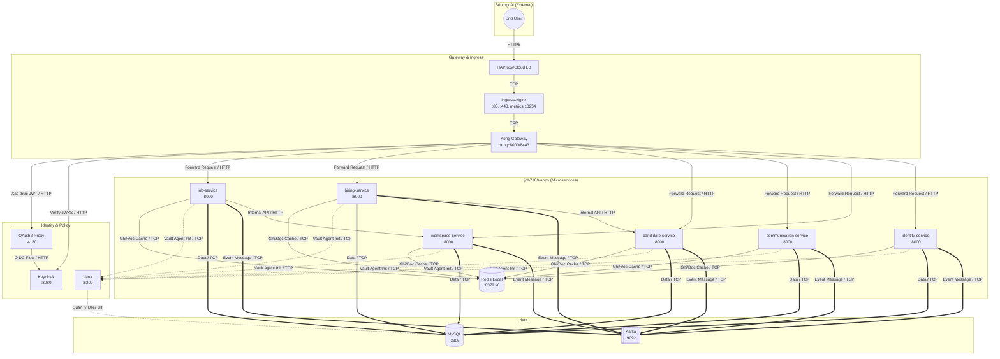
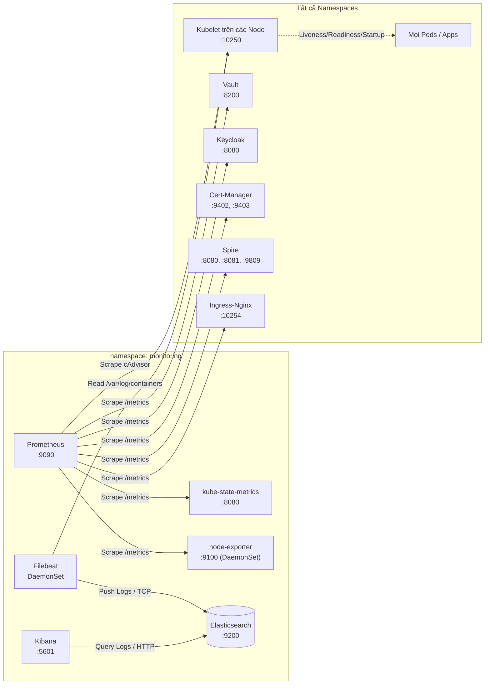
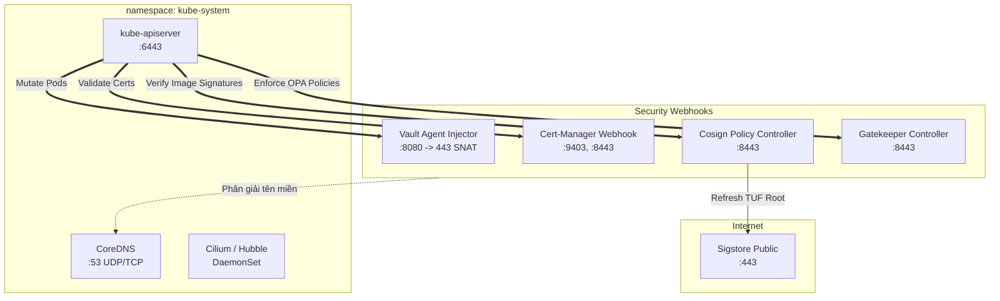

# Bản đồ Kiến trúc Mạng và Phân tích Luồng Dữ liệu (Chi tiết Toàn diện)

Bản đồ này liệt kê **100%** các luồng mạng giữa hơn 70 pods đang hoạt động trên 13 namespaces trong cụm Kubernetes. Mục đích là để làm "Kinh thánh" (Source of Truth) cho việc thiết lập các luật ZTA Microsegmentation (CiliumNetworkPolicy) sau này.

---

## 1. Sơ đồ Cốt lõi: Luồng Ứng dụng & Dữ liệu (Business & Data Flow)

Đây là luồng chính phục vụ người dùng cuối, bao gồm xác thực (N-S) và gọi dịch vụ nội bộ (E-W).

---

## 2. Sơ đồ Quan sát & Giám sát (Observability Flow)

Giám sát metrics và logs từ **mọi pod** trong cụm. Đây là lý do tại sao các Namespace cần mở cổng cho Prometheus và Kubelet.

---

## 3. Sơ đồ Control Plane & Webhook (Security / Admission)

Mọi thao tác tạo Pod đều phải đi qua Kube-apiserver và bị kiểm duyệt bởi các Webhook bảo mật.

---

## 4. Ma trận Bắt chéo (Luật Tường lửa Cilium - Cross-Namespace Matrix)

Bảng này liệt kê chính xác các cổng phải được MỞ (Allow) nếu áp dụng `default-deny` ở mức Namespace.

| Từ (Source Namespace) | Tới (Destination Namespace) | Thành phần Đích | Port / Giao thức | Mục đích |
|---|---|---|---|---|
| **Mọi Namespace** | `kube-system` | CoreDNS | `53` (UDP/TCP) | Phân giải DNS nội bộ. *(Đã từng lỗi do L7 DNS proxy).* |
| **Mọi Node (Kubelet)** | Mọi Namespace | Mọi Pod | Đa dạng (`8080`, `9403`, `6080`...) | Liveness / Readiness Probes. *(Lưu ý: Không dùng L7 Proxy cho Probes).* |
| `monitoring` | `mọi namespace` | Metrics endpoints | `9100`, `10254`, `8080`, `9402`, `9809` | Prometheus cạo (scrape) metrics. |
| `monitoring` (Filebeat) | `monitoring` | Elasticsearch | `9200` (TCP) | Đẩy logs từ các node về trung tâm lưu trữ. |
| `kube-system` (Apiserver) | `vault` | Vault Injector | `8080`/`8443` (TCP) | Kube-apiserver gọi Webhook chèn sidecar. |
| `kube-system` (Apiserver) | `cert-manager` | CM Webhook | `9403`/`8443` (TCP) | Webhook xác nhận CertificateRequest. |
| `kube-system` (Apiserver) | `cosign-system` | Policy Webhook | `8443` (TCP) | Webhook kiểm tra chữ ký container image. |
| `kube-system` (Apiserver) | `gatekeeper-system` | Gatekeeper | `8443` (TCP) | Webhook ép quy định OPA. |
| `job7189-apps` | `vault` | Vault Server | `8200` (TCP) | Các Init Container lấy mật khẩu DB/Redis. |
| `job7189-apps` | `data` | MySQL | `3306` (TCP) | Lưu trữ Database (Đã xác thực bằng mTLS/Vault). |
| `job7189-apps` | `data` | Kafka | `9092` (TCP) | Hệ thống nhắn tin (Event-driven) giữa các microservice. |
| `job7189-apps` | `job7189-apps` | Redis | `6379` (TCP) | Cache/Queue cục bộ (ví dụ: `job-service` -> `job-service-redis`). |
| `job7189-apps` | `job7189-apps` | Dịch vụ khác | `8000` (TCP) | E-W API (vd: `job-service` gọi `workspace-service`). |
| `ingress-nginx` | `gateway` | Kong | `8000`, `8443` (TCP) | Chuyển tiếp HTTP(S) từ Ingress vào Gateway. |
| `job7189-apps` (Các Backend API) | `security` | Keycloak | `8080` (TCP) | Backend fetch JWKS public keys để xác thực JWT token (Tránh lỗi 401 Unauthorized). |
| `gateway` | `security` | OAuth2-Proxy | `4180` (TCP) | Kong chuyển tiếp request để xác thực JWT. |
| `gateway` | `security` | Keycloak | `8080` (TCP) | Kong fetch JWKS public keys để verify chữ ký JWT. |
| `security` (OAuth2-Proxy)| `security` | Keycloak | `8080` (TCP) | O2P lấy OIDC config và token. *(Đã từng lỗi do sai path trong L7 CNP).* |
| `gateway` | `job7189-apps` | Các App Laravel | `8000` (TCP) | Sau khi có Auth, Kong đẩy request xuống Backend. |
| `cosign-system` | `Internet (World)` | Sigstore Public | `443` (TCP) | Refresh TUF keys để verify chữ ký container. |
| `spire` | `kube-system` | Kube-apiserver | `6443` (TCP) | Spire-agent gọi API server để chứng thực Node. |

---

## 5. Kết luận

- Việc thiếu bất kỳ một luồng nào trong ma trận trên sẽ dẫn đến đứt gãy hệ thống (như lỗi DNS timeout của Vault Agent hay lỗi 503 của OAuth2-Proxy).
- **Tuyệt đối lưu ý:** Liveness/Readiness probe từ Kubelet và DNS resolution không nên bị giới hạn bởi các chính sách **L7 Proxy (HTTP/DNS rules)** của Cilium, bởi vì proxy nội bộ có thể gây nghẽn (TCP SYN_RECV) hoặc time-out UDP packets (Cilium agent bug/checksum issues). Chỉ dùng **L4 Policy** cho Kubelet probes và DNS.
