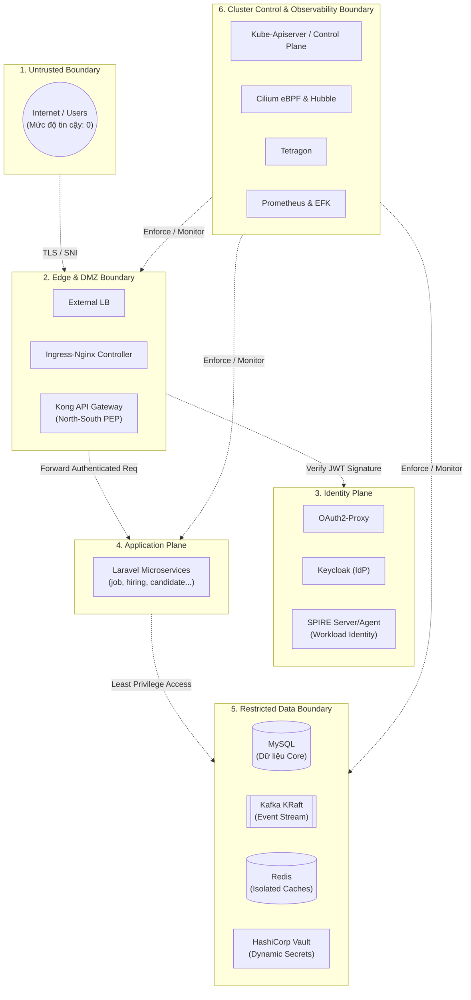
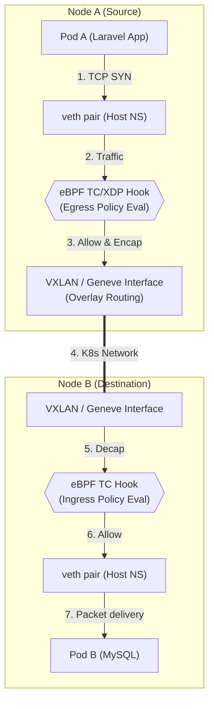

# Zero Trust Microsegmentation Blueprint

Tài liệu này không chỉ đơn thuần là một sơ đồ mạng lưới logic, mà là một **Thiết kế Kiến trúc An toàn (Security Architecture Design)** theo triết lý Zero Trust. Tài liệu này đóng vai trò là "Source of Truth" tuyệt đối để ánh xạ các chính sách mạng (CiliumNetworkPolicy) và có chất lượng tương đương luận án chuyên ngành An toàn thông tin.

---

## 1. Zero Trust Boundaries (Ranh giới Tin cậy)

Theo nguyên tắc "Never trust, always verify", kiến trúc của chúng ta phân chia rõ ràng các ranh giới tin cậy (Trust Boundaries). Tại mỗi điểm giao cắt giữa các ranh giới, lưu lượng mạng bắt buộc phải được kiểm tra (Inspect), xác thực (Authenticate) và cấp quyền (Authorize).

> [!NOTE]
> **Policy Justification:** Bất kỳ lưu lượng nào băng qua các ranh giới này đều phải tuân theo chính sách từ chối mặc định (Default Deny) và yêu cầu có một Policy Intent rõ ràng.

---

## 2. Workload Identity & ServiceAccount Mapping

Cilium và hệ sinh thái Zero Trust Kubernetes không cấp quyền dựa trên IP (vì IP thay đổi liên tục), mà cấp quyền dựa trên **Identity**. Bảng dưới đây ánh xạ Danh tính Khối lượng công việc (Workload Identity).

| Workload | Namespace | Kubernetes SA | SPIFFE ID (mTLS Identity) | Ghi chú / Cấp độ rủi ro |
|---|---|---|---|---|
| `job-service` | `job7189-apps` | `job-service` | `spiffe://cluster.local/ns/job7189-apps/sa/job-service` | App nghiệp vụ / Medium |
| `identity-service` | `job7189-apps` | `identity-service` | `spiffe://cluster.local/ns/job7189-apps/sa/identity-service` | Xử lý User Data / High |
| `vault-agent-init` | `job7189-apps` | (Kế thừa từ App SA) | `spiffe://cluster.local/ns/job7189-apps/sa/*` | Sidecar lấy secret / Critical |
| `vault-0` | `vault` | `vault` | `spiffe://cluster.local/ns/vault/sa/vault` | Secret Engine / Critical |
| `keycloak` | `security` | `keycloak` | `spiffe://cluster.local/ns/security/sa/keycloak` | Core IdP / Critical |
| `kong` | `gateway` | `kong` | `spiffe://cluster.local/ns/gateway/sa/kong` | N-S Choke Point / High |
| `mysql` | `data` | `mysql` | `spiffe://cluster.local/ns/data/sa/mysql` | Storage / High |

---

## 3. Data Plane Enforcement Path (eBPF Hook Points)

Sơ đồ sau mô tả con đường thực tế của gói tin ở tầng hạ tầng mạng khi đi từ Pod A sang Pod B, minh họa cách Cilium áp dụng chính sách ở cấp độ kernel thông qua eBPF mà không cần dựa vào Kube-Proxy hay Iptables (kube-proxy replacement).

> [!TIP]
> **Performance Edge:** Do xử lý ngay tại XDP/TC ở kernel space, Cilium có thể Drop gói tin xấu ngay cả trước khi chúng chạm vào tầng TCP/IP stack của Host, giúp ngăn chặn DDoS và Lateral Movement ở hiệu năng cao nhất.

---

## 4. Phân tích Khối Lượng İş, Failed Domains & Blast Radius

| Thành phần bị xâm nhập (Compromised) | Blast Radius (Tầm ảnh hưởng) | Phương pháp Cô lập / Giảm thiểu (Mitigation) |
|---|---|---|
| **`job-service` pod** | Chỉ gọi được `job-service-redis`, `mysql` (qua Vault lease), `kafka` (produce event) và `workspace-service`. KHÔNG THỂ gọi các pod khác. | Egress Policy cực kỳ chặt chẽ (L4/L7). Redis độc lập cho từng App (Isolated Redis). Tự động thu hồi Secret Lease bằng Vault. |
| **`prometheus` pod** | Enumeration (liệt kê metrics hệ thống) và rò rỉ cấu hình (Leak Config). | Phân tách Namespace, hạn chế quyền RBAC của ServiceAccount (chỉ cho GET /metrics), cấm gọi ra Internet (No Egress World). |
| **`oauth2-proxy`** | Rủi ro bỏ qua xác thực (Auth Bypass) dẫn thẳng vào nội mạng. | Zero Trust Backend: Ngay cả khi qua Proxy, Kong và Backend vẫn kiểm tra JWT Signature (bằng JWKS Keycloak). Backend API không mù quáng tin tưởng Proxy. |
| **`cert-manager-webhook`** | Ngăn chặn cấp phát chứng chỉ mới (Denial of Service). | Hệ thống HA cho Webhook, các chứng chỉ cũ (dài hạn) vẫn hoạt động. Cần Policy L4 cho phép `kube-apiserver` gọi `:9403`. |

---

## 5. Ma trận Chính sách Mạng Intent-Based (Intent, Initiator, Protocol)

Phần này phân loại luồng giao thông theo Semantic Protocol, Chiều khởi tạo (Initiator) và Phân loại luồng (Flow Type) để trả lời câu hỏi: *"Tại sao được phép nói chuyện?"*

### A. Luồng Bắt buộc Hệ thống (Mandatory/Bootstrap Flows)
| Source | Dest | Initiator | Flow Type | Protocol Semantics | Intent / Justification |
|---|---|---|---|---|---|
| Mọi Pod | `kube-dns` (`:53`) | Client | Bootstrap | UDP/TCP | Pod cần phân giải FQDN (ví dụ: gọi external API, gọi service khác). |
| `vault-agent` | `vault` (`:8200`) | Client | Bootstrap | HTTPS/TCP | Init container cần kéo DB/Redis credentials (Just-in-Time) trước khi Laravel khởi động. |
| `spire-agent` | `spire-server` | Push | Operational | gRPC/TCP | Xác thực Node và workload, duy trì SVIDs. |

### B. Luồng Nghiệp Vụ Cốt Lõi (Core Business Flows)
| Source | Dest | Initiator | Flow Type | Protocol Semantics | Intent / Justification |
|---|---|---|---|---|---|
| `ingress-nginx` | `kong` (`:8000`) | Client | Mandatory | HTTP/1.1 / TCP | Nhận external traffic và định tuyến vào N-S PEP Gateway. |
| `kong` | `oauth2-proxy` | Pull/Auth | Mandatory | HTTP/1.1 | Kong forward check Auth Header để cấp phép user session. |
| `oauth2-proxy` | `keycloak` | Client | Mandatory | HTTP/1.1 | Lấy thông tin OIDC (OpenID Connect) và verify user token. |
| `kong` | `keycloak` | Pull | Mandatory | HTTP/1.1 | Lấy JWKS để tự verify JWT cục bộ mà không cần round-trip liên tục. |
| Laravel Apps | `keycloak` | Client | Mandatory | HTTP/1.1 | Các microservice (như `identity-service`) gọi Keycloak để lấy JWKS xác thực JWT (Tránh lỗi 401 Unauthorized). |
| `kong` | Laravel Apps | Client | Mandatory | HTTP/1.1 | Đẩy request đã xác thực (có đính kèm JWT) vào Backend. |

### C. Luồng Dữ Liệu East-West (Data Flows)
| Source | Dest | Initiator | Flow Type | Protocol Semantics | Intent / Justification |
|---|---|---|---|---|---|
| Laravel Apps | Tương ứng `*-redis` | Client | Mandatory | TCP (RESP) | Ghi/đọc bộ đệm (Cache) và Queue. Mỗi app có 1 Redis riêng biệt (Isolated). |
| Laravel Apps | `mysql` (`:3306`) | Client | Mandatory | MySQL Protocol | Ghi/đọc dữ liệu. Truy cập được cấp bằng Vault Lease. |
| Laravel Apps | `kafka-0` (`:9092`) | Producer / Consumer | Mandatory | Kafka Binary | Async Event-Driven architecture (KRaft mode single-node). |
| `job-service` | `workspace-service` | Client | Operational | HTTP/REST | Luồng giao tiếp đồng bộ giữa 2 Domain giới hạn. |

### D. Luồng Điều khiển & Giám sát (Control & Observability Flows)
| Source | Dest | Initiator | Flow Type | Protocol Semantics | Intent / Justification |
|---|---|---|---|---|---|
| `prometheus` | Mọi Endpoint | Pull | Operational | HTTP/1.1 (`/metrics`) | Gom nhặt số liệu sức khỏe hệ thống từ mọi pod (Node, Apps, Vault, Keycloak...). |
| `filebeat` (Host) | `elasticsearch` | Push | Operational | TCP (`:9200`) | Filebeat quét file `/var/log/containers` trên Node và đẩy về trung tâm ES. |
| Kubelet (Node) | Mọi Pod | Node-initiated | Operational | HTTP / TCP (Probes) | Kubernetes kiểm tra Liveness/Readiness/Startup. Cần L4 Egress Policy từ Node. |
| Hubble Agent | Hubble Relay | Push | Security | gRPC/TCP | Truyền dữ liệu eBPF network flow về UI để trực quan hóa bảo mật. |

### E. Luồng Phụ Thuộc Bên Ngoài (External Egress Dependencies)
| Source | Dest | Initiator | Flow Type | Protocol Semantics | Intent / Justification |
|---|---|---|---|---|---|
| Laravel Apps | `smtp.gmail.com:587` | Push | Mandatory | SMTP/TCP | Gửi email thông báo cho ứng viên/nhà tuyển dụng. |
| `cosign-system` | Sigstore Public | Pull | Security | HTTPS/443 | Tải Root keys từ TUF để xác thực chữ ký của Image (Image Signing Validation). |
| Kubelet / CRI | Internet (Docker Hub/GHCR) | Pull | Bootstrap | HTTPS/443 | Kéo (pull) Container Image về Node. |
| CoreDNS | Upstream DNS (8.8.8.8) | Pull | Operational | UDP/53 | Phân giải các tên miền không thuộc `.cluster.local`. |

---

## 6. Luồng Vận hành của Operator và Kubectl (Administrative Flows)

Một sai lầm phổ biến khi thiết lập Zero Trust là chặn mất đường quản trị. Các luồng sau phải được thiết kế dưới dạng **Administrative Flow**:

- **Kube-apiserver -> Webhooks:** (Cert-Manager, Vault Injector, Cosign, Gatekeeper). Yêu cầu Policy Ingress cho phép traffic từ `kube-system` vào các cổng webhook (`8443`, `9403`...).
- **Kube-apiserver -> Kubelet (10250):** Được gọi khi user thực hiện `kubectl exec`, `kubectl logs`, `port-forward`. Nếu chặn Egress từ apiserver xuống node, các lệnh debug này sẽ tê liệt.
- **Operator Reconciliation Loops:** Các Pod Operator (như `cilium-operator`, `tetragon-operator`) liên tục theo dõi (Watch) API Server (`6443`) để phản hồi thay đổi cấu trúc K8s. Chúng cần quyền Egress L4 tới `kube-apiserver`.

---

## 7. Kết luận và Hướng Dẫn Kỹ Thuật cho Cilium

Dựa vào Blueprint này, khi hiện thực hóa mã YAML của `CiliumNetworkPolicy`, hãy tuân thủ nguyên tắc:

1. **Khởi đầu bằng Deny All:** Luôn áp dụng một `CiliumNetworkPolicy` rỗng (bắt cả ingress và egress) cho Namespace để cô lập nó.
2. **Khoan lỗ có chủ đích (Pinhole Egress):** Cho phép Egress tới CoreDNS (L4), Vault (L4), và Kube-apiserver cho các pods khởi động cơ bản (Bootstrap Flows). Cảnh giác với L7 DNS Proxy (đã từng gây `i/o timeout`).
3. **Mở luồng Ingress cho Control Plane:** Luôn có luật Ingress cho phép Kubelet thực hiện Probes và Prometheus cạo Metrics để tránh hệ thống "chết chìm trong im lặng".
4. **Cô lập theo Workload, không theo Namespace:** Ví dụ: Chỉ dán nhãn `matchLabels: {app: job-service}` mới được quyền egress tới Redis có nhãn `app: job-service-redis`. Không dùng nhãn mờ ảo như `app: redis` cho toàn cục.
5. **Giám sát vi phạm (Security Telemetry):** Bật Tetragon để cảnh báo nếu bất kỳ tiến trình nào trong Pod (ngoài PHP-FPM) cố gắng mở kết nối mạng không mong muốn (vd: curl, netcat). Theo dõi `policy-verdict: drop` trên Hubble.
